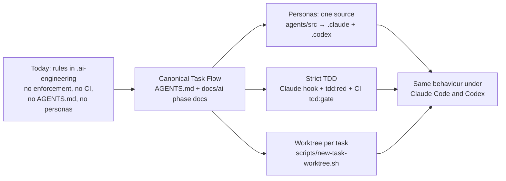

## Plan — Port the Claude Code engineering workflow into dlsu-gate-system-portal

**TL;DR.** This repo already has a rulebook (`.ai-engineering/`), but nothing enforces it. The reference repo (tarraula-command-center) has the same rulebook plus the enforcement:

- a fixed task flow in `AGENTS.md`
- phase docs loaded at each step
- generated persona agents for Claude and Codex
- a hook that stops code edits until a failing test exists, and a CI gate that re-checks that on every PR
- one worktree per task

It is like a building that has a written fire code; this port adds the alarms and inspections. Every DLSU rule that is still valid stays (the four gate-access invariants, strict TDD, the five-bucket QA gate). Every Tarraula fact is replaced by a DLSU fact with evidence. The TDD machinery switches from `node:test` to this repo's Jest and Vitest.

### Flowchart



### Task metadata

- **Classification:** `INFRASTRUCTURE` (with a documentation part) · Task Size **Deep** (it adds CI and a repo-wide editing hook) · Domain: AI tooling / repo workflow · Risk: the hook and CI change how every future session works.
- **Docs loaded:** `planning.md, plan-template.md` (the reference copies; this repo does not have them yet).
- **Claims reversed while investigating:**
  1. "This repo has CI." Wrong. `.github/` does not exist. `apps/backend/Jenkinsfile` is only a cron that triggers `POST /database-sync/sync`. `apps/backend/.husky/pre-commit` is inactive (`core.hooksPath` is unset and `.git/hooks` has no hooks) and would fail anyway, because it calls `cursor:update-indexes`, which does not exist.
  2. "The reference's `.ai-engineering/` is the full bootstrap install." Wrong. The reference has only the generic scaffold; none of the bootstrap files (`manifest.yaml`, `rules/`, `schemas/`, `adapters/`, `installation-lock.json`) exist there.
- **Detected running model:** `claude-opus-5-5` (Opus 5.5).
- **Recommended model:** Opus 5.5 · high for P1–P3 (script logic and parsers); Opus 5.5 · medium for P0 and P5–P7 (preflight, docs, validation). Fallback: Sonnet 5 · high, for P5–P7 only.
- **Branch:** `chore/no-ticket-claude-workflow-port`, based on `origin/main` (currently `99bc642`).
- **Release path:** one branch → one PR into `main` → merge commit. See "Release flow (derived)".
- **Required skills:** `/graphify` (closeout), `ecc:code-review` (review pass), `caveman` (already on).
- **Execution preflight:** `git fetch origin`, then:
  ```bash
  git worktree add .claude/worktrees/chore-claude-workflow-port -b chore/no-ticket-claude-workflow-port origin/main
  ```
  This uses raw git because `scripts/new-task-worktree.sh` is not on `main` yet.

### Verified facts this plan relies on

| Fact | Evidence |
|---|---|
| Monorepo: Bun 1.2.22 workspaces + Turborepo | `package.json` `packageManager`, `workspaces`, `turbo.json` |
| Backend: NestJS 11 + TypeORM + PostgreSQL + Redis. Tests: Jest 29 + ts-jest, files `src/**/*.spec.ts` | `apps/backend/package.json` (`jest.testRegex`, `rootDir: src`) |
| Backend e2e: `apps/backend/test/*.e2e-spec.ts` via `jest-e2e.json` | `apps/backend/test/` |
| Frontend: Next.js 15 + React 19. Tests: Vitest + jsdom + Testing Library, files `src/**/*.test.{ts,tsx}`. No Playwright. | `apps/portal-web/package.json`, `vitest.config.ts` |
| `apps/portal-web/src/mocks/**` runs at runtime (mock mode), not only in tests | imported by `src/components/providers/mock-mode-provider.tsx` |
| TypeORM migrations: `apps/backend/src/migrations/*.ts`. No migration tests exist. | `git ls-files` |
| Clean-tree baseline is green: BE `tsc` exit 0, BE Jest 21 suites / 273 tests, FE `tsc` exit 0, FE Vitest 17 files / 80 tests, FE `next lint` clean | commands run this session |
| BE `eslint .` reports 5 prettier errors, all in the untracked `apps/backend/scripts/scenario/campaign.ts`. It is not part of this task, and a fresh worktree does not contain it. | `eslint` output |
| Only `main` exists on `origin`. PRs #1 and #2 were merged into `main` as merge commits. | `git branch -a`, `gh pr list` |
| Deploy is manual on Windows Server 2022: `deployment_docs_ws2022_prod/update-monorepo.bat` runs `git pull origin main` | that file |
| GitHub: the repo is **public**, `main` is **not protected** (the API returns 404), and there are 0 Actions workflows | `gh api` |
| graphify is installed (`update`, `query`, `path`, `explain`, `affected`, `cluster-only`, `hook`, …). `graphify-out/graph.json` is tracked; its last commit was 2026-08-11 (stale). | `graphify --help`, `git log` |
| Codex CLI is installed (`codex-cli 0.155.0-alpha.9.2`) | `codex --version` |
| `apps/backend/AGENTS.md` and `apps/portal-web/AGENTS.md` point at `@docs/ai/entry-point.md`, which does not exist (broken today) | file contents |
| Existing `.ai-engineering/` has 59 files, including `knowledge/` (migrated from `docs/ai/` on 2026-08-08) | `MANIFEST.md`, `SETUP.md` |

### Existing Claude setup (inventory)

- **`CLAUDE.md`**: routes into `.ai-engineering/`, lists the non-negotiables (safety invariants, TDD, communication, single-agent operation), holds the Codex-leftover guard, and points to the Linear, triage and domain docs. **Kept; the port merges into it.**
- **`.claude/`**:
  - `settings.json` is `{}`.
  - `launch.json` (portal-web and backend preview) is untouched.
  - `settings.local.json` is **never touched**.
  - There is no `.claude/agents` or `.claude/commands`.
- **Absent:** `.codex/`, root `AGENTS.md`, `.github/`.
- **`docs/agents/{issue-tracker,triage-labels,domain}.md`**: valid, unchanged.
- **`.ai-engineering/`**: richer than the reference's copy; it carries this project's real rules.

### Gap matrix

| # | Reference artifact | Exists here? | Action | Stack-specific substitutions |
|---|---|---|---|---|
| 1 | `AGENTS.md` (core principles, Canonical Task Flow A–Z with node rules, agent routing, dev env, caveman and persona blocks) | No (deleted 2026-07-08) | **create/adapt** | Persona line: self-hosted NestJS + TypeORM/PostgreSQL + Redis API, Next.js 15 portal, Bun/Turborepo, Windows Server 2022 + PM2. Node W: branch → PR → `main`. Drop the "NOT the Next.js you know" block (Next 16; this repo is on 15). Principle 6b names Jest and Vitest. Node S worktree rule kept. "Structured work orders" points to the pilot-frozen doc. |
| 2 | `CLAUDE.md` (`@AGENTS.md` plus project facts) | Yes (router) | **merge** | Prepend `@AGENTS.md`. Keep the router, non-negotiables, and Linear/domain sections. Add, with evidence citations: What it is, Tech stack REAL, Conventions, DB rules (TypeORM migrations, `studentMutationLock`, `Role` enum), How agents operate (branch/PR/deploy), Don't-do list. Rewrite the Codex guard (C7). |
| 3 | `AI_WORKFLOW.md`, `PLANNING_STANDARDS.md` | No | **create** stubs | Point to `docs/ai/*`. `PLANNING_STANDARDS.md` keeps the evidence and Graphify gate mirrors. |
| 4 | `docs/ai/task-router.md` | Partly (`.ai-engineering/workflows/task-intake.md`) | **create** as canonical; `task-intake.md` becomes a pointer | Deep-by-default domains: `auth`, `database-sync` (SQL Server + BioStar), `reports`, account management, TypeORM migrations/entities, screensaver upload, deployment. The polyglot note covers the two apps, the `.bat` deploy scripts, and the Jenkins sync cron. Skill names were checked against this session's skill list: `/investigate`, `ecc:plan`, `ecc:feature-dev`, `ecc:update-docs`, `ecc:code-review`, `/review`, `/qa`, `/qa-only`, `ecc:test-coverage`, `/plan-eng-review`. |
| 5 | `docs/ai/planning.md` | No | **create/adapt** | "Supabase discipline" becomes "TypeORM/PostgreSQL discipline": explicit select, bounded `take`, no N+1, transactions, `studentMutationLock`, BioStar rollback (safety invariant 2). The Migrations rule is rewritten for TypeORM `.ts` migrations and `migration:run`. Dropped: i18n, mobile-first, and the idb-cache scan (none apply; there is no i18n library in deps). The cache scan points at `@nestjs/cache-manager` / Redis. The Graphify phase is kept, limited to installed commands. |
| 6 | `docs/ai/plan-template.md` | Partly (`.ai-engineering/templates/plan.md`) | **create** as canonical, folding in the Bug/Feature/Refactor lane additions; the old template becomes a pointer | Test Matrix layers for Jest and Vitest (see "TDD substitutions") |
| 7 | `docs/ai/execution.md` | No | **create/adapt** | Runners: Jest (BE) and Vitest (FE). Lint commands per app. The `npm install` warning becomes a Bun note: never run an install inside a worktree whose `node_modules` is symlinked. |
| 8 | `docs/ai/handoff.md` | Partly (`.ai-engineering/workflows/release.md`) | **create/adapt** | "Release flow (derived)" replaces dev → stg → main. Branch protection is not enforced (verified), so checking CI by hand is part of the gate. `learnings.md` becomes `.ai-engineering/memory/lessons-learned.md`. |
| 9 | `docs/ai/testing-strategy.md` | Yes (`.ai-engineering/knowledge/testing-strategy.md`) | **move + merge**; add the Strict TDD, enforcement-table, and Mandatory Test Layers sections | Jest and Vitest commands, taken from the existing file |
| 10 | `docs/ai/agent-orchestration.md` | No | **create/adapt** | FE/BE ownership split for two separate apps (see #19). Domain briefings come from the existing `module-ownership-map.md`, with no invented facts: auth, database-sync, reports, students, employee dashboard, users/admin/super-admin, screensaver, settings. Includes the runtime model matrix and the round structure. |
| 11 | `docs/ai/entry-point.md` | No (the nested `AGENTS.md` files already point at it) | **create** | Also repoint the two nested `apps/*/AGENTS.md` files to `../../docs/ai/entry-point.md`. |
| 12 | `docs/ai/context-refresh.md` | Yes (`.ai-engineering/workflows/context-refresh.md`) | **move** (`git mv`) and adapt its paths | |
| 13 | `docs/ai/operating-contract.md` | No | **create** as a pointer | |
| 14 | `docs/ai/autonomous-engineering.md` | No | **create/adapt**, state `PILOT_FROZEN` (Q4) | Obsidian `TAR-####` orders become Linear issues pasted by Romeo (`docs/agents/issue-tracker.md`: there is no API path). No scheduler (`automation: manual`). No Vercel. Release activation only by exact command. |
| 15 | `module-ownership-map`, `risk-register`, `architecture-manifest`, `contracts/{api,db}-contracts`, `file-index/repository-map`, `dev-environment` | Yes, as `.ai-engineering/knowledge/{module-ownership-map,risk-register,architecture,api-contracts,db-contracts,repository-map,environment}.md` | **move** (`git mv`, Q1) and add a Purpose / Load rule / Source of truth header; `test-plans/` moves to `docs/ai/test-plans/` | Content keeps its DLSU facts. Inbound references are rewritten. |
| 16 | `docs/ai/pr-evidence.md` | No | **create/adapt** | There is no PR template here, so this doc defines the full PR structure. UI evidence is a Browser-tool recording, because there is no Playwright. |
| 17 | `docs/ai/prompts/{bugfix-rca,bugfix-plan,feature-plan,refactor-plan}.md` | Partly (`templates/rca-report.md`, the plan lanes) | **create**; `rca-report.md` content merges into `bugfix-rca.md` and the old file becomes a pointer | `node:test` becomes Jest/Vitest. "Characterization tests first" is kept. |
| 18 | `.ai-engineering/` layer and `AUTONOMOUS_ENGINEERING_BOOTSTRAP.md` | Yes (richer than the reference) | **adapt only** (Q4) | `config/autonomous-engineering.yaml` gains `pilot.activation: PILOT_FROZEN` and `release_autonomy: disabled`. `runtime/codex.md` now says Codex is supported. `core/operating-model.md` follows Q2. `MANIFEST.md` records the moved knowledge files and the new guard. `SETUP.md` gets an install record. **Skipped**, because they duplicate an existing responsibility and `MANIFEST.md` forbids duplicates: `core/task-state-machine.md` (= `task-lifecycle.md`), `core/decision-making.md` (= `decision-framework.md`), `core/evidence.md` (= `evidence-policy.md`), and `workflows/{bug,feature,blocker-handling,release-process,daily-schedule}.md` (= the existing `bug-fix`, `feature-development`, `blockers`, `release`, `daily-cycle`). |
| 19 | Personas: `agents/src/*.agent.mjs` + `prompts/*.md` → `scripts/generate-agent-defs.mjs` (+ test) → `.claude/agents/*.md`, `.codex/agents/*.toml`; npm `agents:generate`, `agents:lint` | No | **create/adapt** | See "Persona changes" below the table. |
| 20 | Strict TDD: hook, `scripts/ci/{tdd-lib,tdd-red,tdd-gate,tdd-runner,test-repo}.mjs` + tests, npm `tdd:red`, `tdd:gate`, `test:scripts` | No | **create/adapt** | See "TDD substitutions". Messages are in English. |
| 21 | `scripts/ci/verified-tree.mjs` (+ test) | No | **skip** (default) | It caches results in `/var/lib/tarraula-ci/verified` on a persistent self-hosted runner. GitHub-hosted runners are wiped after every run, so every check here would be a miss and the script would do nothing. Say so if you want it ported anyway. |
| 22 | `.github/workflows/ci.yml`, wiring `tdd:gate` and `agents:lint` | No CI at all | **skip: decided Q3 = "No CI yet"** | `tdd:gate` ships as an npm script. `docs/ai/handoff.md` makes a local `npm run tdd:gate` run, with its output pasted in the PR, part of the Completion Gate. `agents:lint` runs from the pre-commit hook. The gap is logged under residual risks. |
| 23 | `scripts/new-task-worktree.sh`; `.claude/worktrees/` gitignored | No | **create** | Adds `chore` and `docs` branch types (the repo already uses `chore/` branches). |
| 24 | Graphify: node K rule, mandatory plan and closeout phases, `scripts/graphify/*.py` augmentation | graphify is installed; the graph is stale | **port the rule and phases; skip all 12 augmentation scripts** | `db_bridge` and `pg_objects` parse Supabase SQL, but this repo writes migrations as TypeORM `.ts`. `route_map` assumes `src/app` at the repo root. `ci_workflows` and `infra_config` read Tarraula's own files. The other six (`prepare_layers`, `merge_fragments`, `build_graph`, `label_and_report`, `remap_labels`, `residual_files`) only work inside that fragment pipeline. This repo builds its graph with the standard `/graphify` flow. |
| 25 | `scripts/git-hooks/pre-commit` (blocks commits on `main`, runs `agents:lint`) + `prepare` | Not in your list; the husky file here is dead | **create** (default), wired through the existing root `postinstall` | `apps/backend/.husky/pre-commit` is left untouched (inactive and out of scope). |
| 26 | `.claude/settings.json` PreToolUse hook | `{}` | **merge** | |
| 27 | `docs/plans/<branch>.md` (the approved plan is saved there) | No | **create** | |
| 28 | `docs/ai/agent-parity.md` | Not in the reference either (it says "when it exists") | **gap, skip** | |

**Persona changes (gap row 19).**

- **Specialists replaced for this stack:**
  - `supabase-architect` → **`database-architect`** (TypeORM entities + migrations)
  - `be-agent` → **`nestjs-backend-dev`**
  - `nextjs-frontend-dev` is kept but rewritten for Next 15 and this portal.
- **Generic six kept:** project-manager, code-reviewer, security-auditor, test-engineer, ui-ux-designer, accessibility-auditor.
- **File ownership:**
  - `nextjs-frontend-dev`: `apps/portal-web/src/**`
  - `database-architect`: `apps/backend/src/migrations/**` and `apps/backend/src/**/entities/**`
  - `nestjs-backend-dev`: the rest of `apps/backend/src/**`. The doc states that the two database-architect globs are excluded.
- **Shared contract:** the backend DTO. The backend owns it; the frontend mirrors it and never edits it.
- **Models:** copied from the reference. Claude `sonnet`. Codex `gpt-5.6-sol`, with `high` reasoning for project-manager, nestjs-backend-dev, security-auditor and database-architect, and `medium` for the rest.
- **Generator:** `GLOBAL_POLICY` in `scripts/generate-agent-defs.mjs` is rewritten for this stack and its invariants.

### Decisions (answered 2026-09-23)

- **Q1:** `git mv` the knowledge files into `docs/ai/`.
- **Q2:** use the reference persona dispatch.
- **Q3:** **no CI yet**, so P4 is removed.
- **Q4:** mirror the reference and record `PILOT_FROZEN`.

### Conflicts with existing rules (your call)

| ID | Existing rule | Reference rule | Recommendation |
|---|---|---|---|
| **Q1** | Facts live in `.ai-engineering/knowledge/` (moved there from `docs/ai/` on 2026-08-08) | Facts live in `docs/ai/*`, next to the phase docs | `git mv` them into `docs/ai/`, keeping history. That leaves one home per fact and matches the reference paths used by `AGENTS.md`, the personas and the generator test. `.ai-engineering/` keeps only rules. |
| **Q2** | "Single-agent operation: roles adopted in sequence, no dispatched sub-agents" (`CLAUDE.md`, `core/operating-model.md`) | Automatic `project-manager` dispatch; FE and BE personas run in parallel, then a QA fan-out | Adopt the reference: you asked for Claude/Codex parity. The `.ai-engineering/agents/*.md` roles stay as the role contracts the personas follow. |
| **Q3** | No CI exists | CI runs the `tdd:gate` and `agents:lint` jobs | Create `.github/workflows/ci.yml` on GitHub-hosted runners. The repo is public, so the minutes are free. |
| **Q4** | — | `AUTONOMOUS_ENGINEERING_BOOTSTRAP.md` is a 142 KB installer (manifest, rules, schemas, adapters, lock, simulation, schedules). The reference never ran it. | Mirror what the reference actually installed: keep the existing `.ai-engineering/`, record `PILOT_FROZEN`, and add `docs/ai/autonomous-engineering.md` with release autonomy off. The full installer would create a second rule tree that duplicates `docs/ai/`. |
| C5 | `communication-contract.md`: "implement one step at a time; after each step explain what was built" | Node U: the same model pair continues automatically. Your global rule is low-narration. | The reference wins on pacing. Keep "plan before implementing", "TL;DR with an analogy", "push back", and "exact identifiers". |
| C6 | Size scale Tiny/Express/Standard/Deep ("do not substitute") | Intent enums plus a `SMALL/MEDIUM/LARGE` complexity scale. The reference `testing-strategy` also uses Tiny…Deep. | Keep Tiny/Express/Standard/Deep as the only size scale, add the reference Intent enums, and drop `SMALL/MEDIUM/LARGE`. |
| C7 | The Codex-leftover guard flags a reappearing `AGENTS.md` or `.codex/` | Both are required | You asked for both, so narrow the guard to `CLAUDE_CODEX.md`, `.ai-scratchpad.md`, and `.claude/settings.example.json`. |
| C8 | Deep tasks need approval before the plan; Standard and Deep plans need approval | Every plan needs approval (node R) | Adopt the reference: it is stricter and nowhere looser. |
| C9 | Recent commits (`99bc642`, `8d11729`, …) went straight to `main` | The pre-commit hook blocks commits on `main` | Port it. It matches your hard rule "never commit to main", but it changes your habit on this repo. |

### TDD substitutions (the core adaptation)

**Guarded source.** The hook blocks edits to these paths and the gate requires tests for them:

- `apps/backend/src/**/*.ts`, except `*.spec.ts`, `*.d.ts`, and `src/migrations/**` (migrations are their own kind).
- `apps/portal-web/src/**/*.ts`, except `*.test.ts`, `*.d.ts`, and `src/test/**` (Vitest setup). `src/mocks/**` stays guarded because it runs at runtime.
- `apps/portal-web/src/**/*.tsx`, except `*.test.tsx`. This is the UI kind.

**Test kinds.**

| Kind | Files | Used for RED? |
|---|---|---|
| `jest` | `apps/backend/src/**/*.spec.ts` | Yes (runnable) |
| `vitest` | `apps/portal-web/src/**/*.test.{ts,tsx}` | Yes (runnable) |
| `scriptTests` | `scripts/**/*.test.mjs`, run with `node --test` | Yes (runnable) |
| `backendE2e` | `apps/backend/test/**/*.e2e-spec.ts` | No. The gate only checks that the file exists, as the reference does for e2e. |
| `migrationTests` | `apps/backend/src/migrations/**/*.spec.ts` or `apps/backend/test/**/*migration*` | — |

**Layer rule.**

- A logic change needs a runnable test.
- A `.tsx` change needs a Vitest component test (`*.test.tsx`). This replaces the reference's Playwright requirement. Waiver line: `UI-Test-Waiver:`.
- A migration needs a migration test or a `Migration-Waiver:` line. None exist today, so every migration PR must add the first one or state a waiver.

**Runner.**

- Jest (cwd `apps/backend`): `npx jest --json --outputFile=<tmp> --runTestsByPath <abs paths>`
- Vitest (cwd `apps/portal-web`): `npx vitest run --reporter=json --outputFile=<tmp> <paths>`
- Both write Jest-compatible JSON, which the runner parses (`testResults[].assertionResults[].{title,status}`). A suite that fails to load and has zero assertions counts as a file-level RED (for example, it imports a module that does not exist yet).
- Script tests keep the reference's TAP parser.

**Other rules.**

- The gate re-runs the PR's tests against the base code in a throwaway worktree, with the root `node_modules` and `apps/*/node_modules` symlinked in.
- Case prefixes and order: `error:` > `edge:` > `regression:` > `happy:`, checked on the `it(` / `test(` titles the diff adds. Existing specs are grandfathered. Known limit, same as the reference: titles written as `it.each(...)(...)` are not parsed.
- The promotion skip (`PROMOTION_REFS`) is dropped, because there are no dev or stg branches.

### Release flow (derived; there is no dev or stg)

1. One task branch → one PR into `main`, merged with **"Create a merge commit"**. Evidence: PRs #1 and #2 were merged this way.
2. CI must be green. Check it by hand with `gh pr checks <n>`, because `main` is not protected.
3. Deploy is manual and belongs to Romeo: `update-monorepo.bat` on the WS2022 server (`git pull origin main` plus a build). The docs say so; no agent deploys.

### Phases

**P0 — Preflight (Opus 5.5, medium).**

1. Run `git fetch origin`, then create the worktree and branch (command in Task metadata).
2. Symlink the root and `apps/*` `node_modules` into the worktree. No install runs.
3. Save this approved plan to `docs/plans/chore-claude-workflow-port.md` and commit it as `docs(plans): ...`.

Done when the worktree sits on the fetched `origin/main` head (`99bc642` today) and `git status` is clean after the commit.

→ **Switch stop:** the next phase is Opus 5.5 · high.

**P1 — RED: script tests (Opus 5.5, high).**

1. Create the adapted tests:
   - `scripts/ci/tdd-lib.test.mjs`
   - `scripts/ci/tdd-red.test.mjs`
   - `scripts/ci/tdd-gate.test.mjs`
   - `scripts/hooks/tdd-red-guard.test.mjs`
   - `scripts/generate-agent-defs.test.mjs`
   - `scripts/ci/test-repo.mjs`: a fixture helper that builds disposable repos containing a tiny `apps/backend` Jest project and an `apps/portal-web` Vitest project, reusing the real `node_modules`.
2. Order the cases `error:` > `edge:` > `regression:` > `happy:`.
3. Run `node --test "scripts/**/*.test.mjs"`. It must fail, because the modules do not exist yet.
4. Commit as `test(workflow): ...`.

Done when the failing output is captured.

**P2 — GREEN: TDD engine, hook, worktree script, git hook (Opus 5.5, high).**

1. Create:
   - `scripts/ci/{tdd-lib,tdd-runner,tdd-red,tdd-gate}.mjs`
   - `scripts/hooks/tdd-red-guard.mjs`
   - `scripts/new-task-worktree.sh`
   - `scripts/git-hooks/pre-commit`
2. Modify:
   - `package.json`: add the scripts `tdd:red`, `tdd:gate`, `test:scripts`, `agents:generate`, `agents:lint`, `hooks:install`, and change `postinstall` to `patch-package && git config core.hooksPath scripts/git-hooks || true`.
   - `.claude/settings.json`: add the hook block.
   - `.gitignore`: add `.claude/worktrees/`.
3. Check that Bun runs the root `postinstall`, using a scratch directory with a zero-dependency `package.json`. This is UNVERIFIED until then.
4. Commit once per logical unit.

Done when the script tests pass.

**P3 — Personas (Opus 5.5, high).**

1. Create `agents/src/*.agent.mjs` and `agents/src/prompts/*.md` for the 9 personas, plus `scripts/generate-agent-defs.mjs`.
2. Run `npm run agents:generate`. It writes `.claude/agents/0{1..9}-*.md` and `.codex/agents/*.toml`.
3. Check `~/.codex/config.toml` for the model ID. If `gpt-5.6-sol` is not configured, stop and ask.
4. Commit.

Done when `agents:lint` is clean.

→ **Switch stop:** the next phase is Opus 5.5 · medium.

**P5 — Docs port (Opus 5.5, medium).**

1. Create:
   - `AGENTS.md`, `AI_WORKFLOW.md`, `PLANNING_STANDARDS.md`
   - `docs/ai/{task-router,planning,plan-template,execution,handoff,agent-orchestration,entry-point,operating-contract,autonomous-engineering,pr-evidence}.md`
   - `docs/ai/prompts/*.md`
2. Move with `git mv` (per Q1):
   - `knowledge/*` → `docs/ai/{architecture-manifest,module-ownership-map,risk-register,testing-strategy,dev-environment}.md`, `docs/ai/contracts/{api,db}-contracts.md`, `docs/ai/file-index/repository-map.md`, `docs/ai/test-plans/`
   - `workflows/context-refresh.md` → `docs/ai/context-refresh.md`
3. Modify:
   - `CLAUDE.md`
   - `.ai-engineering/{MANIFEST,SETUP}.md`
   - `.ai-engineering/config/autonomous-engineering.yaml`
   - `.ai-engineering/core/{operating-model,communication-contract,engineering-rules,evidence-policy,safety}.md`: path updates only, plus the Q2 and C5 edits
   - `.ai-engineering/runtime/{claude,codex,scheduler}.md`
   - `.ai-engineering/workflows/{task-intake,bug-fix,feature-development,refactor,daily-cycle,release}.md`: pointers and path updates
   - `.ai-engineering/templates/{plan,rca-report}.md`: pointers
   - `.ai-engineering/agents/qa.md`: paths
   - `apps/backend/AGENTS.md`, `apps/portal-web/AGENTS.md`
4. Commit.

Done when the P6 link check finds no dangling relative path.

**P6 — Validation and Graphify closeout (Opus 5.5, medium).**

1. Run every command under "Validation and acceptance" and paste the outputs.
2. Run `/graphify . --update`, using the semantic flow because docs changed. Report the graph diff and the token cost. **Cost warning:** the graph is about 40 days stale, so the update re-extracts every file changed since 2026-08-11, not only this task's files.
3. Commit as `chore(graphify): ...`.

**P7 — Handoff (Opus 5.5, medium).**

1. Run `git fetch origin`. If `origin/main` moved, rebase (the branch is not pushed yet) and re-run validation.
2. Run `git push --set-upstream origin <branch>`.
3. Open a non-draft PR into `main`. Title and body are in **Spanish and English**, in plain language for a non-technical reviewer, followed by the technical sections from `pr-evidence.md`.
4. Deliver the final report with the status block.

### Validation and acceptance

**Test Matrix.**

| Layer | Required? | File | Cases |
|---|---|---|---|
| Unit (script tests) | required | `scripts/**/*.test.mjs` | **error:** malformed hook JSON, unknown tool, marker for another branch, corrupt marker. **edge:** new file under a non-existent dir, symlinked tmp, `sed -i` / redirect / `tee` / `cp` targets, a quoted `>` inside a string, suite load failure. **regression:** only `happy:` failing is not RED. **happy:** a valid RED unblocks; the gate passes when tests fail on the base. |
| Component (Vitest) | not required | — | the diff changes no `apps/*/src` |
| Backend e2e | not required | — | no backend change |
| Migration | not required | — | no migration |
| Smoke | not required | — | no deployable app change |

**Commands.** All run in the worktree, with outputs shown.

1. `npm run agents:generate`, then `npm run agents:lint`. Must be clean.
2. `npm run test:scripts`. The hook, TDD and generator tests must pass.
3. **Hook proof**, in a throwaway worktree branched from the task branch:
   1. Pipe `{"tool_name":"Edit","tool_input":{"file_path":"apps/backend/src/app.service.ts"}}` into `node scripts/hooks/tdd-red-guard.mjs`. Expect exit **2** and the block message.
   2. Add a failing `error:` spec and run `npm run tdd:red`. Expect the RED to be recorded.
   3. Pipe the same JSON again. Expect exit **0**.
   4. Remove the throwaway worktree.
4. `npm run tdd:gate` with `TDD_GATE_BASE=origin/main`. On the task branch, expect a pass, since no guarded source changed. On the throwaway branch, expect the RED to be proved against the base.
5. Regression checks: nothing broke.
   - BE: `npx tsc --noEmit`, `npx eslint .`, `npx jest` (expect 21 suites / 273 tests).
   - FE: `tsc --noEmit`, `next lint`, `npx vitest run` (expect 17 files / 80 tests).
6. Doc link check: a one-off script in the scratchpad resolves every relative path and every backticked repo path in `AGENTS.md`, `CLAUDE.md`, `AI_WORKFLOW.md`, `PLANNING_STANDARDS.md`, `docs/ai/**`, `.ai-engineering/**`, and `apps/*/AGENTS.md`. Zero dangling paths allowed.
7. `/graphify . --update` evidence.

Acceptance: all 7 pass.

### Rollback

- **Before merge:** close the PR. Romeo deletes the branch and worktree by hand; nothing deletes them automatically.
- **After merge:** in a new branch, run `git revert -m 1 <merge-sha>` and open a PR. The knowledge files return to `.ai-engineering/knowledge/` with their history.
- **Local hook path:** `git config --unset core.hooksPath`.
- Nothing here touches app code, the database, the servers, or production.

### Residual risks

- Once this is merged, every Claude session on this repo is blocked from editing `apps/*/src` until `tdd:red` records a RED or a waiver. That is intended, but it applies to hotfixes too. Escape hatch: `npm run tdd:red -- --waiver "<reason>"`.
- The Jest and Vitest JSON parsing is a heuristic. A ts-jest compile error counts as a file-level RED, as it does in the reference.
- The repo is **public**. The knowledge docs being moved (risk register, auth gaps) are already public; moving them changes nothing, but you should know.
- The Graphify update will cost a lot of tokens because the graph is stale.
- **No CI (Q3):** nothing enforces `tdd:gate` on PRs. It relies on the handoff rule and honest PR evidence. Codex sessions get no hook at all, so this manual gate is their only TDD check.
- Live hook enforcement starts only after merge and a new session, because the hook runs from the primary checkout. P6 proves the behavior by calling the hook directly.

### Open items / UNVERIFIED

Each one is resolved during execution, or the plan stops.

- Whether Bun runs the root `postinstall`. Checked in P2.
- Whether the Codex model ID `gpt-5.6-sol` is configured on this machine. Checked in P3; the plan stops if it is absent.
- Whether `update-monorepo.bat` runs migrations. Read in P5, before `dev-environment.md` and `handoff.md` state it.
- Attribution:
  - Commits keep the `Co-Authored-By` trailer.
  - The PR body has **no** Claude trailer and no "Generated with" line, per your instruction.
  - Say so if you also want commits without the trailer.

### Deviations from the reference `plan-template.md`

The steps list files and name the reference source plus the substitutions. They do not include the literal full content of each file inline, which would be about 300 KB. Each phase produces that content from the named reference file and the substitution tables above. Every fact in the output traces to a row in "Verified facts", or is marked UNVERIFIED.
