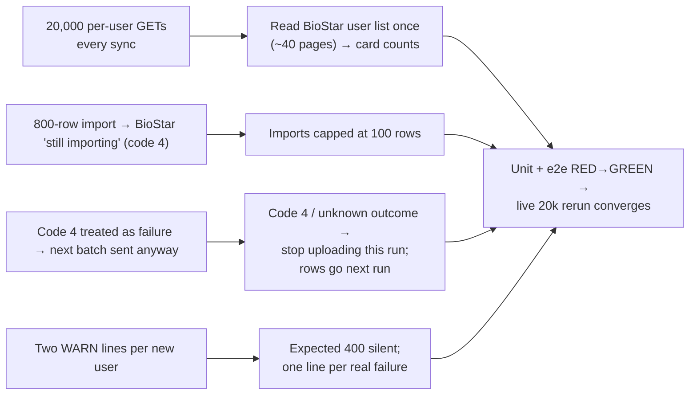

## DASMA → BioStar: import in small steps, stop when BioStar is busy, and look cards up from one list

**TL;DR.** Picture a post office clerk. We were asking about every parcel one at a time
(20,000 questions per sync). Then we handed over an 800-letter sack. When the clerk said
"still sorting", we took it as a no, handed over the next sack, and started asking about the
next 800 parcels.

The fix:
- Read the clerk's register once (the BioStar user list, about 40 pages for 20k) instead of
  asking per parcel.
- Hand over 100 letters at a time.
- When the clerk says "still sorting", stop for today. The rest goes next run.

The expected "not in BioStar yet" answer stops flooding the log. Nothing about who gets gate
access changes.

### Flowchart (high-level)



### Task metadata

- Classification: `BUG_FIX` (+ PERFORMANCE, logs) · Deep · database-sync (Dasma path) · High.
- Docs loaded: `planning.md, plan-template.md`
- RCA: approved by Romeo 2026-09-23. The full RCA is in this session's plan history, and its
  facts are restated where they are used below.
- **Claims reversed while investigating:**
  - "Each user is tried 3 times": a `400` returns on attempt 1 (`biostar-api.service.ts:260-264`).
  - "Batch 1 failed": 730 of 730 active batch-1 rows are in BioStar.
  - "The GETs were running during the batch-1 import": the code awaits all lookups before
    uploading. They did run during the import that continued in the background after `code 4`.
- **Root cause:** `executeDatabaseSync` imports up to `SYNC_BATCH_SIZE` (800) rows per
  `csv_import`, maps `Response.code "4"` to `'failed'` (`database-sync-dasma-path.service.ts`,
  `outcome` ~1945), and continues to the next batch. The next batch fires a new import and one
  GET per card-less row (`resolveCsn`) while BioStar is still importing.
- **Gate-access invariants touched:**
  - (1) `studentMutationLock` is untouched. The new `csv_import` timeout bounds how long the
    run holds it.
  - (2) BioStar rollback / no blanked card: preserved. The empty `csn` goes only to a user the
    list shows absent or card-less. A listed user with a card is still looked up. If the list
    cannot be read in full, the code falls back to today's per-user lookup.
  - (3) Role checks and (4) `reports` writes: none.
- Detected running model: Claude Opus 5.5 (`claude-opus-5-5`).
- Recommended model: `opus`, high reasoning, for every phase, so there is no switch stop.
  Fallback: `sonnet`, high.
- Branch: `fix/no-ticket-dasma-biostar-import-pacing`, from `origin/main`.
- Release path: one branch → one PR into `main` → merge commit. The merge is Romeo's.
- Required skills: `ecc:code-review` (review phase), `/qa` five-bucket sweep.
- **Persona rounds:**
  - The personas in `.claude/agents/` arrived with `origin/main` after this session started,
    so they are not registered as subagent types here.
  - The main session therefore adopts the roles in sequence (`.ai-engineering/core/operating-model.md`):
    test-engineer (Phase 2), nestjs-backend-dev (Phase 3), then code-reviewer and
    security-auditor (Phase 5).
- **Graphify:**
  - Skipped. Romeo said on 2026-09-23 that Graphify isn't fully set up yet.
  - `graphify explain "resolveCsn"` returned "No node matching".
  - `graphify query` returned 112 unrelated nodes.
  - Discovery therefore used `grep` and direct reads. The Graphify closeout is skipped for
    the same reason.
- Execution preflight: `git fetch origin`, then `scripts/new-task-worktree.sh fix dasma-biostar-import-pacing`.

Paths below are relative to `apps/backend/`: `D` = `src/database-sync/services/database-sync-dasma-path.service.ts`,
`B` = `src/database-sync/services/shared/biostar-api.service.ts`.

---

### Phase 0 — Local reset of stuck job 28 (`opus`, high) — runs right after approval, primary checkout DB only

Romeo approved this on 2026-09-23 ("yes reset job 28"). Two statements, the log line first:

```bash
cd /Users/romeoangelesjr/Documents/meraki/dlsu-gate-system-portal && echo "{\"ts\":\"$(date -u +%Y-%m-%dT%H:%M:%SZ)\",\"system\":\"postgres\",\"op\":\"update\",\"count\":1,\"ids\":[\"sync_queue:28\"],\"note\":\"status processing -> failed (backend stopped mid-run)\"}" >> apps/backend/logs/scenario/write-log.jsonl
```

```bash
cd /Users/romeoangelesjr/Documents/meraki/dlsu-gate-system-portal && PGPASSWORD=$(grep -E '^DB_PASSWORD=' .env | cut -d= -f2- | tr -d '"') psql -h localhost -p 5433 -U postgres -d dlsu_gate_system -c "UPDATE sync_queue SET status = 'failed', \"completedAt\" = now() WHERE id = 28 AND status = 'processing'"
```

Done: psql prints `UPDATE 1`.

### Phase 1 — Worktree, carry-over, plan copy (`opus`, high)

```bash
cd /Users/romeoangelesjr/Documents/meraki/dlsu-gate-system-portal && git fetch origin && scripts/new-task-worktree.sh fix dasma-biostar-import-pacing
```

```bash
cd /Users/romeoangelesjr/Documents/meraki/dlsu-gate-system-portal/.claude/worktrees/fix-dasma-biostar-import-pacing && git cherry-pick aac6fbf 59512e8
```

Copy this plan to `docs/plans/dasma-biostar-import-pacing.md` in the worktree, then commit it:

```bash
git add docs/plans/dasma-biostar-import-pacing.md && git commit -m "docs(plans): DASMA BioStar import pacing and list-based card lookup"
```

Done: `git log --oneline origin/main..HEAD` shows 3 commits.

All later commands run inside the worktree.

### Phase 2 — RED (`opus`, high)

**2a. Rename carried test titles to the required prefixes** (no reordering is needed with these titles):

| File | Old line | New line |
|---|---|---|
| `src/database-sync/services/shared/database-sync-common.service.spec.ts` | `  it('adds the elapsed milliseconds to the phase', () => {` | `  it('edge: adds the elapsed milliseconds to a phase that has not run yet', () => {` |
| same | `  it('sums a phase that runs once per batch', () => {` | `  it('edge: sums a phase that runs once per batch', () => {` |
| `src/database-sync/services/database-sync-dasma-path.service.spec.ts` | `    it('reports wall time per phase for the roster push', async () => {` | `    it('edge: reports wall time for every push phase, even one that never ran', async () => {` |
| same | `    it('counts the BioStar card lookups a card-less roster costs every run', async () => {` | `    it('edge: counts a per-user card lookup when the BioStar user list is unavailable', async () => {` |
| same | `    it('names exactly the rows it sent to BioStar', async () => {` | `    it('regression: names exactly the rows it sent to BioStar', async () => {` |
| same | `    it('reports wall time per phase for the BioStar pull', async () => {` | `    it('happy: reports wall time per phase for the BioStar pull', async () => {` |

In the path spec, replace these two comment lines:

```ts
    // A person with no card is looked up in BioStar on every run, changed or
    // not. At 20,000 people that is 20,000 requests per sync, so it is counted.
```

with:

```ts
    // The unit fake has no user list, so this is the fallback path: a person
    // with no stored card is looked up per run, and each lookup is counted.
```

**2b. Faithful source paging in the three fakes.** The service now asks for `FETCH NEXT <min(SYNC_BATCH_SIZE, cap)>`. The fakes must honour the SQL they receive.

`src/database-sync/services/database-sync-dasma-path.service.spec.ts` — Old:

```ts
          // fetchBatches pages with OFFSET n ROWS; serve everything on page 1.
          const offsetMatch = text.match(/OFFSET (\d+) ROWS/);
          const offset = offsetMatch ? Number(offsetMatch[1]) : 0;
```

New:

```ts
          // Honour the page the service asked for, as a real server would.
          const offsetMatch = text.match(/OFFSET (\d+) ROWS/);
          const offset = offsetMatch ? Number(offsetMatch[1]) : 0;
          const fetchMatch = text.match(/FETCH NEXT (\d+) ROWS/);
          const size = fetchMatch ? Number(fetchMatch[1]) : sourceRows.length;
```

Old:

```ts
          return {
            recordset:
              offset === 0 ? sourceRows.map((row) => ({ ...row })) : [],
          };
```

New:

```ts
          return {
            recordset: sourceRows
              .slice(offset, offset + size)
              .map((row) => ({ ...row })),
          };
```

`src/database-sync/services/database-sync-dasma-csv.spec.ts` — Old:

```ts
          // The service reads the batch size from process.env directly, not
          // from ConfigService, so the fake pool must page by the same value or
          // its offsets and ours drift apart.
          const size = Number(process.env.SYNC_BATCH_SIZE ?? '500');
```

New:

```ts
          // Page by exactly what the service asked for, as a real server would.
          const size = Number(text.match(/FETCH NEXT (\d+) ROWS/)?.[1] ?? 500);
```

`test/dasma-sync-biostar.e2e-spec.ts` — Old:

```ts
          const size = Number(process.env.SYNC_BATCH_SIZE ?? '500');
          const offset = Number(text.match(/OFFSET (\d+) ROWS/)?.[1] ?? 0);
```

New:

```ts
          const size = Number(text.match(/FETCH NEXT (\d+) ROWS/)?.[1] ?? 500);
          const offset = Number(text.match(/OFFSET (\d+) ROWS/)?.[1] ?? 0);
```

**2c. Keep the existing volume tests' meaning under the new cap.**

`src/database-sync/services/database-sync-dasma-csv.spec.ts`:
- In `it('costs 25 overwrite imports on the first run and none on the second'`, Old:
  `      process.env.SYNC_BATCH_SIZE = '800'; // the value the DASMA server runs`
  New: that line, then on the next line `      CONFIG.BIOSTAR_IMPORT_MAX_ROWS = '800';`
- In `it('sends only the handful that changed, not the batches they sit in'`, Old: the first
  `      process.env.SYNC_BATCH_SIZE = '800';` inside it. New: that line, then
  `      CONFIG.BIOSTAR_IMPORT_MAX_ROWS = '800';`
- In `it('is unaffected by the batch size'`, Old:
  `      process.env.SYNC_BATCH_SIZE = '500'; // the code default`
  New: that line, then `      CONFIG.BIOSTAR_IMPORT_MAX_ROWS = '500';`

`test/dasma-sync-biostar.e2e-spec.ts`, in `it('spreads a multi-batch roster across one upload per batch'`. Old:

```ts
      process.env.SYNC_BATCH_SIZE = '500';
      try {
        sourceRows = Array.from({ length: 1200 }, (_, i) =>
```

New:

```ts
      process.env.SYNC_BATCH_SIZE = '500';
      try {
        service = await makeService({ BIOSTAR_IMPORT_MAX_ROWS: '500' });
        sourceRows = Array.from({ length: 1200 }, (_, i) =>
```

In the same file, `it('round-trips a BioStar card through a real bigint column'`. Old:

```ts
      cards: [{ card_id: '9876543210' }],
    };
    service = await makeService({});
```

New:

```ts
      cards: [{ card_id: '9876543210' }],
    };
    // The real server lists every user it holds; the lookup now starts there.
    biostar.listPages = [
      { total: 1, rows: [{ user_id: '12100001', card_count: '1' }] },
    ];
    service = await makeService({});
```

**2d. New tests.**

In `src/database-sync/services/shared/biostar-api.service.spec.ts`, replace Old
`import { ConfigService } from '@nestjs/config';` with:

```ts
import { ConfigService } from '@nestjs/config';
import { Logger } from '@nestjs/common';
```

Then append at the end of the file:

```ts
describe('BiostarApiService — quiet, list-based lookups', () => {
  let service: BiostarApiService;

  const CONFIG: Record<string, string> = {
    BIOSTAR_API_BASE_URL: 'https://biostar.fake',
    BIOSTAR_API_LOGIN_ID: 'fake',
    BIOSTAR_API_PASSWORD: 'fake',
  };

  beforeEach(async () => {
    jest.clearAllMocks();
    const module: TestingModule = await Test.createTestingModule({
      providers: [
        BiostarApiService,
        {
          provide: ConfigService,
          useValue: { get: jest.fn((key: string) => CONFIG[key]) },
        },
      ],
    }).compile();
    service = module.get(BiostarApiService);
  });

  afterEach(() => jest.restoreAllMocks());

  const httpError = (status: number) => {
    (axios.isAxiosError as unknown as jest.Mock) = jest.fn(() => true);
    return Object.assign(
      new Error(`Request failed with status code ${status}`),
      { isAxiosError: true, response: { status } },
    );
  };
  const page = (total: number, rows: Record<string, unknown>[]) => ({
    data: { UserCollection: { total: String(total), rows } },
  });

  it('error: returns null when a page of the user list cannot be read', async () => {
    (axios.get as jest.Mock).mockRejectedValueOnce(httpError(500));

    await expect(
      service.listUserCardCounts('t0ken', 's3ss10n'),
    ).resolves.toBeNull();
  });

  it('error: logs one line, not two, for a detail failure it cannot explain', async () => {
    const warn = jest.spyOn(Logger.prototype, 'warn').mockImplementation();
    (axios.get as jest.Mock).mockRejectedValue(httpError(500));

    await service.fetchBiostarUserDetail('ZZTEST001', 't0ken', 's3ss10n', 1);

    expect(warn).toHaveBeenCalledTimes(1);
    expect(warn.mock.calls[0]).toHaveLength(1);
  });

  it('edge: returns null when BioStar lists fewer users than it reports', async () => {
    (axios.get as jest.Mock).mockResolvedValueOnce(
      page(3, [
        { user_id: 'A', card_count: '0' },
        { user_id: 'B', card_count: '1' },
      ]),
    );

    await expect(
      service.listUserCardCounts('t0ken', 's3ss10n'),
    ).resolves.toBeNull();
  });

  // 20,000 new students used to print 40,000 WARN lines per sync: "not in
  // BioStar yet" is the normal answer for everyone being enrolled.
  it('regression: says nothing when BioStar does not hold the user (400)', async () => {
    const warn = jest.spyOn(Logger.prototype, 'warn').mockImplementation();
    (axios.get as jest.Mock).mockRejectedValue(httpError(400));

    await expect(
      service.fetchBiostarUserDetail('ZZTEST001', 't0ken', 's3ss10n', 3),
    ).resolves.toMatchObject({ definitive: true });
    expect(warn).not.toHaveBeenCalled();
  });

  it('happy: maps every listed user to their card count across pages', async () => {
    const first = Array.from({ length: 500 }, (_, i) => ({
      user_id: String(i),
      card_count: '0',
    }));
    (axios.get as jest.Mock)
      .mockResolvedValueOnce(page(501, first))
      .mockResolvedValueOnce(
        page(501, [{ user_id: '91200000', card_count: '2' }]),
      );

    const counts = await service.listUserCardCounts('t0ken', 's3ss10n');

    expect(counts?.size).toBe(501);
    expect(counts?.get('91200000')).toBe(2);
    expect(counts?.get('0')).toBe(0);
    expect((axios.get as jest.Mock).mock.calls[1][1].params).toMatchObject({
      limit: 500,
      offset: 500,
    });
  });
});
```

In `src/database-sync/services/database-sync-dasma-path.service.spec.ts`, insert directly above the line
`  // The card must never be blanked, and must never be re-fetched forever` (and its preceding
`  // =====…` line, which stays in place above the new block):

```ts
  // =====================================================================
  // BioStar load at scale — measured on the 2026-09-23 stress run
  // =====================================================================
  describe('BioStar load at scale', () => {
    const diag = () =>
      (fsMock.writeFileSync as jest.Mock).mock.calls
        .filter(([p]) => String(p).includes('diagnostics'))
        .map(([, body]) => JSON.parse(String(body)))
        .at(-1);
    const importCalls = () =>
      (axios.post as jest.Mock).mock.calls.filter(([url]) =>
        String(url).includes('/api/users/csv_import'),
      ).length;
    const withCardDirectory = (directory: Map<string, number> | null) =>
      Object.assign(biostarApi, {
        listUserCardCounts: jest.fn(async () => directory),
      });
    const importAnswers = (answer: () => Promise<unknown>) => {
      (axios.post as jest.Mock).mockImplementation(async (url: string) => {
        if (url.includes('/api/attachments')) {
          return { data: { filename: 'fake-upload.csv' } };
        }
        if (url.includes('/api/users/csv_import')) {
          return answer();
        }
        return { data: {} };
      });
    };
    const threeRows = () => [
      sourceRow({ ID: '12100001' }),
      sourceRow({ ID: '12100002' }),
      sourceRow({ ID: '12100003' }),
    ];

    it('error: stops sending imports for the run once BioStar answers "still importing"', async () => {
      CONFIG.BIOSTAR_IMPORT_MAX_ROWS = '1';
      sourceRows = threeRows();
      importAnswers(async () => ({
        data: { Response: { code: '4', task_id: '1470' } },
      }));
      setClock('2026-08-26T08:00:00+08:00');

      await service.executeDatabaseSync('run-1');

      expect(importCalls()).toBe(1);
      const d = diag();
      expect(d.csvImport).toHaveLength(1);
      expect(d.csvImport[0]).toMatchObject({
        outcome: 'timeout',
        taskId: '1470',
      });
      expect(d.csvExport.biostarUploadsHalted).toEqual({
        afterBatch: 1,
        taskId: '1470',
      });
      expect(d.csvExport.rowsDeferredAfterHalt).toBe(2);
      for (const id of ['12100001', '12100002', '12100003']) {
        expect(studentRepo.byId(id)?.biostar_row_hash ?? null).toBeNull();
      }
    });

    it('error: never re-sends an import whose request failed after it went out', async () => {
      sourceRows = threeRows();
      importAnswers(async () => {
        throw new Error('socket hang up');
      });
      setClock('2026-08-26T08:00:00+08:00');

      await service.executeDatabaseSync('run-1');

      expect(importCalls()).toBe(1);
      expect(diag().csvImport[0]).toMatchObject({ outcome: 'timeout' });
      expect(diag().csvExport.biostarUploadsHalted).toEqual({
        afterBatch: 1,
        taskId: null,
      });
    }, 30000);

    it('edge: asks BioStar per user when its user list cannot be read', async () => {
      withCardDirectory(null);
      sourceRows = [sourceRow({ ID: '12100001' })];
      setClock('2026-08-26T08:00:00+08:00');

      await service.executeDatabaseSync('run-1');

      expect(biostarApi.fetchBiostarUserDetail).toHaveBeenCalledWith(
        '12100001',
        't0ken',
        's3ss10n',
        3,
        expect.anything(),
      );
      expect(diag().csvExport.csnApiLookups).toBe(1);
    });

    it('edge: looks up only a listed user whose card PostgreSQL does not hold', async () => {
      withCardDirectory(
        new Map([
          ['12100001', 1],
          ['12100002', 0],
        ]),
      );
      biostarDetails['12100001'] = {
        user_id: '12100001',
        cards: [{ card_id: '4242424242' }],
      };
      // Already swept, so the remark sweep cannot be mistaken for a lookup.
      for (const id of ['12100001', '12100002', '12100003']) {
        studentRepo.rows.push({
          ID_Number: id,
          Name: 'Santos, Juan',
          Campus_Entry: 'Y',
          isArchived: false,
          remarks_checked_at: new Date('2026-08-01T00:00:00+08:00'),
        } as Student);
      }
      sourceRows = threeRows();
      setClock('2026-08-26T08:00:00+08:00');

      await service.executeDatabaseSync('run-1');

      expect(
        (biostarApi.fetchBiostarUserDetail as jest.Mock).mock.calls.map(
          ([id]) => id,
        ),
      ).toEqual(['12100001']);
      expect(csvRowFor('12100001')?.csn).toBe('4242424242');
      expect(csvRowFor('12100002')?.csn).toBe('');
      expect(csvRowFor('12100003')?.csn).toBe('');
      expect(diag().csvExport.csnApiLookups).toBe(1);
    });

    it('regression: a roster BioStar does not hold yet costs no per-user request', async () => {
      withCardDirectory(new Map());
      sourceRows = threeRows();
      setClock('2026-08-26T08:00:00+08:00');

      await service.executeDatabaseSync('run-1');

      expect(biostarApi.fetchBiostarUserDetail).not.toHaveBeenCalled();
      expect(latestCsv().map((r) => r.csn)).toEqual(['', '', '']);
      expect(diag().csvExport.csnApiLookups).toBe(0);
    });

    it('regression: the remark sweep stamps a user BioStar does not hold without asking', async () => {
      withCardDirectory(new Map());
      sourceRows = [sourceRow({ ID: '12100001' })];
      setClock('2026-08-26T08:00:00+08:00');

      await service.executeDatabaseSync('run-1');

      expect(studentRepo.byId('12100001')?.remarks_checked_at).toBeInstanceOf(
        Date,
      );
      expect(biostarApi.fetchBiostarUserDetail).not.toHaveBeenCalled();
      expect(diag().remarks.sweptThisRun).toBe(1);
    });

    it('regression: logs in for a card lookup only when a batch needs one', async () => {
      withCardDirectory(new Map());
      CONFIG.BIOSTAR_IMPORT_MAX_ROWS = '1';
      sourceRows = threeRows();
      setClock('2026-08-26T08:00:00+08:00');

      await service.executeDatabaseSync('run-1');

      // One login for the user list, one per upload; none for card lookups.
      expect(biostarApi.getApiToken).toHaveBeenCalledTimes(4);
    });

    it('happy: records how long each import took and the rows-per-import cap', async () => {
      sourceRows = [sourceRow({ ID: '12100001' })];
      setClock('2026-08-26T08:00:00+08:00');

      await service.executeDatabaseSync('run-1');

      const d = diag();
      expect(d.csvImport[0]).toMatchObject({
        outcome: 'success',
        taskId: null,
      });
      expect(Number.isInteger(d.csvImport[0].durationMs)).toBe(true);
      expect(d.csvExport.importMaxRows).toBe(100);
      expect(d.csvExport.biostarUploadsHalted).toBeNull();
    });
  });

```

In `src/database-sync/services/database-sync-dasma-csv.spec.ts`, directly after the line `    const buildRoster = () =>` block ends (the line `      );` followed by a blank line and `    it('costs 25 overwrite imports`), insert:

```ts
    it('edge: splits a large change into imports of BIOSTAR_IMPORT_MAX_ROWS rows', async () => {
      process.env.SYNC_BATCH_SIZE = '800';
      sourceRows = Array.from({ length: 250 }, (_, i) =>
        sourceRow({ ID: String(12100000 + i) }),
      );

      await service.executeDatabaseSync('run-1');

      // No cap configured: 100, the only size Suprema documents.
      expect(importCallCount).toBe(3);
      expect(rowCountsPerCsv).toEqual([100, 100, 50]);
    }, 120000);

```

In `test/dasma-sync-biostar.e2e-spec.ts`, directly before `  it('records no hash when the import fails, so the row goes again', async () => {`, insert:

```ts
  it('error: sends BioStar nothing more once an import answers "still importing"', async () => {
    service = await makeService({ BIOSTAR_IMPORT_MAX_ROWS: '1' });
    sourceRows = [
      sourceRow(),
      sourceRow({ ID: '12100002', FirstName: 'Maria' }),
    ];
    biostar.scenario.importCode = '4';

    await service.executeDatabaseSync('e2e-1');

    expect(biostar.countOf('/api/users/csv_import')).toBe(1);
    expect((await byId('12100001')).biostar_row_hash).toBeNull();
    expect((await byId('12100002')).biostar_row_hash).toBeNull();

    biostar.scenario.importCode = '0';
    await service.executeDatabaseSync('e2e-2');

    expect(biostar.countOf('/api/users/csv_import')).toBe(3);
    expect((await byId('12100002')).biostar_row_hash).toMatch(/^[0-9a-f]{64}$/);
  }, 120000);

  it('regression: enrolling a new roster asks BioStar nothing per user', async () => {
    await service.executeDatabaseSync('e2e-1');

    expect(biostar.countOf('/api/users/12100001')).toBe(0);
    expect(biostar.lastUploadText().split('\n')[1]).toContain('12100001');
  }, 90000);

```

**2e. Run RED and commit.**

```bash
npm run tdd:red
```

Required: the run fails.
- **Must fail:**
  - the 5 new `biostar-api` tests (the suite cannot compile: `listUserCardCounts` does not exist);
  - the 8 new path-spec tests;
  - the new csv-spec `edge: splits…` test.
- **May pass at RED time** (the carried timings code already provides them):
  - `edge: asks BioStar per user when its user list cannot be read`;
  - the 4 renamed carried tests.
- **Every other existing test must still pass.** If one fails, stop and report.

Then run the e2e suite:

```bash
cd apps/backend && TZ=Asia/Manila npx jest --config ./test/jest-e2e.json
```

The two new e2e tests must fail. `round-trips a BioStar card…` passes, because pre-fix code
ignores the list. Paste both outputs into the PR.

```bash
git add apps/backend/src apps/backend/test && git commit -m "test(dasma): RED for import pacing, code 4 halt, list-based card lookup and quiet 400s"
```

### Phase 3 — GREEN (`opus`, high)

**3a. `B` (`shared/biostar-api.service.ts`)**

B1. Old:

```ts
    try {
      this.logger.log('Attempting to authenticate with BIOSTAR API...');
      const response = await axios.post(
```

New:

```ts
    try {
      const response = await axios.post(
```

B2. Old:

```ts
      this.logger.log('Successfully authenticated with BIOSTAR API');
      return { token, sessionId };
```

New:

```ts
      return { token, sessionId };
```

B3. Old:

```ts
      this.logger.log(`[Biostar] Cleared ${fieldName} for user ${userId}`);
      return true;
```

New:

```ts
      return true;
```

B4. Old:

```ts
        this.logger.warn(
          `[Dasma Biostar] Detail fetch failed for user ${userId} (attempt ${attempt + 1}/${maxRetries}, status ${status ?? 'none'}):`,
          axios.isAxiosError(err) ? err.message : err,
        );
        // Only an explicit "no such user" is an answer. Everything else,
        // retries included, leaves the question open.
        return {
          detail: null,
          status,
          definitive: status === 400 || status === 404,
        };
```

New:

```ts
        // Only an explicit "no such user" is an answer. Everything else,
        // retries included, leaves the question open.
        const definitive = status === 400 || status === 404;
        // "No such user" is the ordinary answer for everyone not enrolled yet
        // — 20,000 new students printed 40,000 lines per sync. Callers count
        // those; only a failure nobody can explain is worth a line, and one
        // line, not the two a second logger argument prints.
        if (!definitive) {
          this.logger.warn(
            `[Dasma Biostar] Detail fetch failed for user ${userId} after ${attempt + 1} attempt(s), status ${status ?? 'none'}: ${
              axios.isAxiosError(err) ? err.message : String(err)
            }`,
          );
        }
        return { detail: null, status, definitive };
```

B5. Old:

```ts
  getApiBaseUrl(): string {
```

New:

```ts
  /**
   * Every BioStar user's card count, read from the user list in one pass.
   *
   * The list already carries `card_count`, 500 users a page, so 20,000 users
   * cost 40 requests instead of one detail request each. Returns null when
   * the list cannot be read in full — a failed page, or fewer rows than
   * BioStar says it holds — because a partial map would call a listed user
   * "not in BioStar", and the caller must then fall back to asking per user.
   */
  async listUserCardCounts(
    token: string,
    sessionId: string,
  ): Promise<Map<string, number> | null> {
    const pageSize = 500;
    const counts = new Map<string, number>();
    try {
      for (let offset = 0; ; offset += pageSize) {
        const response = await axios.get(`${this.apiBaseUrl}/api/users`, {
          params: { limit: pageSize, offset, order_by: 'name:true' },
          headers: {
            Authorization: `Bearer ${token}`,
            'bs-session-id': sessionId,
            accept: 'application/json',
          },
          httpsAgent: new https.Agent({ rejectUnauthorized: false }),
          timeout: 120000,
        });
        const collection = response.data?.UserCollection;
        const rows = (collection?.rows ?? []) as Record<string, unknown>[];
        const total = parseInt(String(collection?.total ?? 0), 10) || 0;
        for (const row of rows) {
          if (row.user_id == null) continue;
          counts.set(
            String(row.user_id),
            parseInt(String(row.card_count ?? 0), 10) || 0,
          );
        }
        if (rows.length === 0 || offset + pageSize >= total) {
          return counts.size >= total ? counts : null;
        }
      }
    } catch (error) {
      this.logger.warn(
        `[Dasma Biostar] Could not read the user list; card lookups fall back to one request per user: ${
          (error as Error)?.message ?? String(error)
        }`,
      );
      return null;
    }
  }

  getApiBaseUrl(): string {
```

**3b. `D` (`database-sync-dasma-path.service.ts`)**

D1. Old:

```ts
/** Mirrors the same constant in the common service, which owns the stored window. */
const ACTIVATION_VALIDITY_YEARS = 10;
```

New:

```ts
/** Mirrors the same constant in the common service, which owns the stored window. */
const ACTIVATION_VALIDITY_YEARS = 10;

/**
 * Upper bound on one csv_import request. BioStar answers code 4 on its own
 * when an import outlives its request timeout; this bound is only for a
 * server that never answers, which would otherwise hold studentMutationLock
 * for good.
 */
const CSV_IMPORT_TIMEOUT_MS = 10 * 60 * 1000;
```

D2. Old:

```ts
        outcome: 'success' | 'partial' | 'failed';
        partialFailureRows: number;
        retriesUsed: number;
      }> = [];
```

New:

```ts
        outcome: 'success' | 'partial' | 'failed' | 'timeout';
        partialFailureRows: number;
        retriesUsed: number;
        /** Wall time of the csv_import request itself. */
        durationMs: number;
        /** BioStar's task id when it answered "still importing" (code 4). */
        taskId: string | null;
      }> = [];
```

D3. Old:

```ts
      /** Rows sent to BioStar for a card lookup — every card-less row, every run. */
      let csnApiLookups = 0;
```

New:

```ts
      /** Card lookups actually sent to BioStar this run. */
      let csnApiLookups = 0;
```

D4. Old:

```ts
      const nameTruncatedForBiostar = new Set<string>();

      const batchSize = parseInt(process.env.SYNC_BATCH_SIZE) || 500;
```

New:

```ts
      const nameTruncatedForBiostar = new Set<string>();
      /**
       * Set once BioStar answers "still importing" (code 4) or an import's
       * outcome is unknown. From then on this run sends BioStar nothing more:
       * a second import on top of an unfinished one is what piled work onto
       * the sandbox on 2026-09-23. Those rows keep no hash, so they go next run.
       */
      let biostarUploadsHalted: {
        afterBatch: number;
        taskId: string | null;
      } | null = null;
      /** Changed rows held back because uploads were halted this run. */
      let rowsDeferredAfterHalt = 0;

      // One source page becomes one csv_import. A 746-row import got code 4
      // ("still importing") on 2026-09-23, so the page is capped. 100 is the
      // only size Suprema documents (bulk edit); each import's durationMs is
      // in the diagnostics so the cap is tuned from data, not guessed.
      const importMaxRows = Math.max(
        1,
        parseInt(this.configService.get('BIOSTAR_IMPORT_MAX_ROWS') ?? '', 10) ||
          100,
      );
      const batchSize = Math.min(
        parseInt(process.env.SYNC_BATCH_SIZE) || 500,
        importMaxRows,
      );
```

D5. Old:

```ts
      for await (const { batchRecords, batchNumber } of this.fetchBatches(
```

New:

```ts
      // Who BioStar holds and how many cards each has, read once per run.
      // Replaces a detail request per card-less row (about 6 a second; 20,000
      // per sync at DLSU's size). null = the list could not be read in full,
      // and every lookup below falls back to asking per user, as before.
      const cardDirectory = await this.loadCardDirectory();

      for await (const { batchRecords, batchNumber } of this.fetchBatches(
```

D6. Old:

```ts
        this.logger.log(
          `[Batch ${batchNumber}] Synced ${toCreate.length + toUpdate.length} records (${batchRecordsWithPhoto.length - (toCreate.length + toUpdate.length)} unchanged)`,
        );
        rowsChanged += toCreate.length + toUpdate.length;
```

New:

```ts
        rowsChanged += toCreate.length + toUpdate.length;
```

D7. Old:

```ts
        const csnStart = Date.now();
        const { token: csnToken, sessionId: csnSessionId } =
          await this.biostarApiService.getApiToken();
        const csnRateLimitTracker = { count: 0 };
```

New:

```ts
        const csnStart = Date.now();
        // Logged in only if a row in this batch really needs a lookup; with the
        // card directory most batches need none.
        let csnSessionPromise: Promise<{
          token: string;
          sessionId: string;
        }> | null = null;
        const csnSession = () =>
          (csnSessionPromise ??= this.biostarApiService.getApiToken());
        const csnRateLimitTracker = { count: 0 };
```

D8. Old:

```ts
              this.logger.warn(
                `[Batch ${batchNumber}] Skipping record with validation errors - ID: ${record.ID_Number}, Errors: ${validationErrors.join(', ')}`,
              );
              return null;
```

New:

```ts
              return null;
```

D9. Old:

```ts
        let csnFilledFromApi = 0;
        /** Cards learned from BioStar this batch, to write back once. */
```

New:

```ts
        /** Cards learned from BioStar this batch, to write back once. */
```

D10. Old:

```ts
            const hadDbCsn = !!this.normalizeUniqueIdValue(
              existingMap.get(userId)?.Unique_ID,
            );
            if (!hadDbCsn) csnApiLookups++;
            const { csn, unresolved, fetched } =
              await this.resolveDasmaCsnForCsvRow(
                userId,
                existingMap.get(userId),
                csnToken,
                csnSessionId,
                csnRateLimitTracker,
              );
            if (!hadDbCsn && csn) {
              csnFilledFromApi++;
            }
            if (fetched) {
```

New:

```ts
            const { csn, unresolved, fetched, lookedUp } =
              await this.resolveDasmaCsnForCsvRow(
                userId,
                existingMap.get(userId),
                csnSession,
                csnRateLimitTracker,
                cardDirectory,
              );
            if (lookedUp) csnApiLookups++;
            if (fetched) {
```

D11. Old:

```ts
        csvRowsEmitted += formattedRecords.length;
        csvEmittedIds.push(...formattedRecords.map((r) => r.user_id));
```

New:

```ts
        // BioStar is still working on an earlier import this run. Sending more
        // would stack imports on the server; these rows keep no hash and go on
        // the next run. PostgreSQL is already up to date for them.
        if (biostarUploadsHalted && formattedRecords.length > 0) {
          rowsDeferredAfterHalt += formattedRecords.length;
          continue;
        }
        csvRowsEmitted += formattedRecords.length;
        csvEmittedIds.push(...formattedRecords.map((r) => r.user_id));
```

D12. Old:

```ts
        if (formattedRecords.length === 0) {
          batchesSkippedNoChanges++;
          this.logger.log(
            `[Batch ${batchNumber}] No changed rows (${csvRowsSuppressed} unchanged so far); skipping CSV upload entirely.`,
          );
          continue;
        }

        if (csnFilledFromApi > 0) {
          this.logger.log(
            `[Batch ${batchNumber}] Dasma CSV CSN: filledFromBiostarApi=${csnFilledFromApi}`,
          );
        }

        await csvWriter.writeRecords(formattedRecords);
        this.logger.log(
          `[Batch ${batchNumber}] CSV file created at ${csvFilePath}`,
        );
```

New:

```ts
        if (formattedRecords.length === 0) {
          batchesSkippedNoChanges++;
          continue;
        }

        await csvWriter.writeRecords(formattedRecords);
```

D13. Old:

```ts
        await this.commonService.logSyncedRecords(
          formattedRecords,
          jobName,
          true,
        );

        const uploadStart = Date.now();
        let retries = 3;
```

New:

```ts
        const uploadStart = Date.now();
        let retries = 3;
        // Once the import request has gone out, its outcome is BioStar's. A
        // retry in the same run would start a second import on top of the
        // first, so any error after this point stops uploads instead.
        let importSent = false;
        let importStart = 0;
```

D14. Old:

```ts
            uploadFormData.append('file', fs.createReadStream(csvFilePath));
            this.logger.log(
              `[Batch ${batchNumber}] Uploading CSV file to attachments...`,
            );
            const uploadResponse = await axios.post(
```

New:

```ts
            uploadFormData.append('file', fs.createReadStream(csvFilePath));
            const uploadResponse = await axios.post(
```

D15. Old:

```ts
            const uploadedFileName = uploadResponse.data.filename;
            this.logger.log(
              `[Batch ${batchNumber}] File uploaded successfully as: ${uploadedFileName}`,
            );
```

New:

```ts
            const uploadedFileName = uploadResponse.data.filename;
```

D16. Old:

```ts
            this.logger.log(`[Batch ${batchNumber}] Importing CSV file...`);
            const importResponse = await axios.post(
              `${apiBaseUrl}/api/users/csv_import`,
              importPayload,
              {
                headers: {
                  'Content-Type': 'application/json',
                  Authorization: `Bearer ${token}`,
                  'bs-session-id': sessionId,
                },
                httpsAgent: new https.Agent({
                  rejectUnauthorized: false,
                }),
              },
            );
```

New:

```ts
            importSent = true;
            importStart = Date.now();
            const importResponse = await axios.post(
              `${apiBaseUrl}/api/users/csv_import`,
              importPayload,
              {
                headers: {
                  'Content-Type': 'application/json',
                  Authorization: `Bearer ${token}`,
                  'bs-session-id': sessionId,
                },
                httpsAgent: new https.Agent({
                  rejectUnauthorized: false,
                }),
                timeout: CSV_IMPORT_TIMEOUT_MS,
              },
            );
            const importDurationMs = Date.now() - importStart;
```

D17. Old:

```ts
            const outcome: 'success' | 'partial' | 'failed' =
              codeText === '0'
                ? 'success'
                : codeText === '1'
                  ? 'partial'
                  : 'failed';
            csvImportOutcomes.push({
              batchNumber,
              responseCode: responseCode ?? null,
              outcome,
              partialFailureRows:
                importResponse.data?.CsvRowCollection?.rows?.length ?? 0,
              retriesUsed: 3 - retries,
            });
```

New:

```ts
            // "4" is not in Suprema's public docs. Measured live on 2026-09-23:
            // "Synced Web Request is not respond in timeout period", with a
            // task_id, and BioStar kept importing every row afterwards.
            const outcome: 'success' | 'partial' | 'failed' | 'timeout' =
              codeText === '0'
                ? 'success'
                : codeText === '1'
                  ? 'partial'
                  : codeText === '4'
                    ? 'timeout'
                    : 'failed';
            const taskIdRaw = importResponse.data?.Response?.task_id;
            const taskId = taskIdRaw == null ? null : String(taskIdRaw);
            csvImportOutcomes.push({
              batchNumber,
              responseCode: responseCode ?? null,
              outcome,
              partialFailureRows:
                importResponse.data?.CsvRowCollection?.rows?.length ?? 0,
              retriesUsed: 3 - retries,
              durationMs: importDurationMs,
              taskId,
            });
```

D18. Old:

```ts
                timingsMs,
              );
              this.logger.log(
                `[Batch ${batchNumber}] CSV import successful — all ${formattedRecords.length} changed records processed`,
              );
            } else if (outcome === 'failed') {
```

New:

```ts
                timingsMs,
              );
            } else if (outcome === 'timeout') {
              biostarUploadsHalted = { afterBatch: batchNumber, taskId };
              this.logger.warn(
                `[Batch ${batchNumber}] BioStar is still importing (Response.code=4, task_id=${taskId ?? '(none)'}); no more uploads this run — the remaining changed rows go next run`,
              );
            } else if (outcome === 'failed') {
```

D19. Old:

```ts
              : `Upload Error: ${error.message}`;
            if (retries === 0) {
```

New:

```ts
              : `Upload Error: ${error.message}`;
            if (importSent) {
              // Code 8 is Suprema's documented "every row failed", delivered as
              // HTTP 404: BioStar is done and a repeat would fail the same way.
              // Anything else leaves the import possibly still running.
              const allFailed =
                axios.isAxiosError(error) &&
                String(error.response?.data?.Response?.code ?? '') === '8';
              csvImportOutcomes.push({
                batchNumber,
                responseCode: allFailed ? '8' : null,
                outcome: allFailed ? 'failed' : 'timeout',
                partialFailureRows: 0,
                retriesUsed: 2 - retries,
                durationMs: Date.now() - importStart,
                taskId: null,
              });
              failedRecordsAll.push({
                batchNumber,
                error: 'csv_import did not complete',
                details: errorMessage,
              });
              if (!allFailed) {
                biostarUploadsHalted = { afterBatch: batchNumber, taskId: null };
              }
              this.logger.warn(
                `[Batch ${batchNumber}] csv_import ${allFailed ? 'failed for every row (Response.code=8)' : `outcome unknown (${errorMessage}); no more uploads this run`} — these rows go next run`,
              );
              break;
            }
            if (retries === 0) {
```

D20. Old:

```ts
        this.commonService.logMemoryUsage(batchNumber);
        await this.commonService.cleanupTempFiles(tempDir);
```

New:

```ts
        await this.commonService.cleanupTempFiles(tempDir);
```

D21. Old:

```ts
      const sweptThisRun = await this.sweepUncheckedRemarks(jobName);
```

New:

```ts
      const sweptThisRun = await this.sweepUncheckedRemarks(
        jobName,
        cardDirectory,
      );
```

D22. Old:

```ts
          emittedIds: this.commonService.capIds(csvEmittedIds),
```

New:

```ts
          emittedIds: this.commonService.capIds(csvEmittedIds),
          // Rows per csv_import this run (BIOSTAR_IMPORT_MAX_ROWS).
          importMaxRows,
          // Set when BioStar answered "still importing" or an import's outcome
          // was unknown; nothing more was sent this run. Null on a clean run.
          biostarUploadsHalted,
          rowsDeferredAfterHalt,
```

D23. Old:

```ts
  private async sweepUncheckedRemarks(jobName: string): Promise<number> {
    const SWEEP_SIZE = 500;
    try {
      const unchecked = await this.studentRepository.find({
        where: { remarks_checked_at: IsNull(), isArchived: false },
        select: ['ID_Number', 'Remarks'],
        take: SWEEP_SIZE,
      });
      if (unchecked.length === 0) return 0;

      const { token, sessionId } = await this.biostarApiService.getApiToken();
      const rateLimitTracker = { count: 0 };
      const flagged: string[] = [];
      const checkedAt = new Date();

      for (const student of unchecked) {
```

New:

```ts
  private async sweepUncheckedRemarks(
    jobName: string,
    cardDirectory: Map<string, number> | null,
  ): Promise<number> {
    const SWEEP_SIZE = 500;
    try {
      const unchecked = await this.studentRepository.find({
        where: { remarks_checked_at: IsNull(), isArchived: false },
        select: ['ID_Number', 'Remarks'],
        take: SWEEP_SIZE,
      });
      if (unchecked.length === 0) return 0;

      const checkedAt = new Date();
      // Someone BioStar did not hold at the start of this run has no remark
      // there to be stale — including everyone this run just created. The
      // user list already answered for them; stamp them in one statement.
      const notInBiostar = new Set(
        cardDirectory
          ? unchecked
              .map((s) => s.ID_Number)
              .filter((id) => !cardDirectory.has(id))
          : [],
      );
      if (notInBiostar.size > 0) {
        await this.studentRepository.update(
          { ID_Number: In([...notInBiostar]) },
          { remarks_checked_at: checkedAt },
        );
      }

      let session: { token: string; sessionId: string } | null = null;
      const rateLimitTracker = { count: 0 };
      const flagged: string[] = [];

      for (const student of unchecked.filter(
        (s) => !notInBiostar.has(s.ID_Number),
      )) {
        session ??= await this.biostarApiService.getApiToken();
        const { token, sessionId } = session;
```

D24. Old:

```ts
   * The lookup is unconditional. It used to sit behind
   * `DASMA_CSV_FETCH_CARD_FROM_BIOSTAR`, which existed to avoid one GET per
   * card-less student per run — but the card is written to `Unique_ID` the
   * first time it is found, so that cost was already one-time. Switching the
   * lookup off left only bad options: send a blank and destroy cards, or hold
   * the row back and stop updating those people at all. A flag whose only safe
   * value is "on" is a trap, so it is gone.
   */
  private async resolveDasmaCsnForCsvRow(
    userId: string,
    existing: Student | undefined,
    token: string,
    sessionId: string,
    rateLimitTracker: { count: number },
  ): Promise<{ csn: string; unresolved: boolean; fetched: boolean }> {
    return this.resolveCsn(
      userId,
      existing,
      token,
      sessionId,
      rateLimitTracker,
    );
  }
```

New:

```ts
   * A card-less student used to cost one GET on EVERY run, because only a
   * found card is written back — 20,000 requests per sync at DLSU's size,
   * measured on 2026-09-23. The BioStar user list answers the same question
   * for everyone at once (`card_count`), so the per-user GET now happens only
   * for a listed user who holds a card we have not stored. A blank cell still
   * goes out only when we positively know there is no card to lose.
   */
  private async resolveDasmaCsnForCsvRow(
    userId: string,
    existing: Student | undefined,
    session: () => Promise<{ token: string; sessionId: string }>,
    rateLimitTracker: { count: number },
    cardDirectory: Map<string, number> | null,
  ): Promise<{
    csn: string;
    unresolved: boolean;
    fetched: boolean;
    lookedUp: boolean;
  }> {
    return this.resolveCsn(
      userId,
      existing,
      session,
      rateLimitTracker,
      cardDirectory,
    );
  }
```

D25. Old (the whole current `resolveCsn` up to its first detail call):

```ts
  private async resolveCsn(
    userId: string,
    existing: Student | undefined,
    token: string,
    sessionId: string,
    rateLimitTracker: { count: number },
  ): Promise<{ csn: string; unresolved: boolean; fetched: boolean }> {
    const fromDb = this.normalizeUniqueIdValue(existing?.Unique_ID);
    if (fromDb) {
      return { csn: fromDb, unresolved: false, fetched: false };
    }
    const { detail, definitive } =
```

New:

```ts
  /** Reads the run's card directory; null means "ask per user", as before. */
  private async loadCardDirectory(): Promise<Map<string, number> | null> {
    try {
      const { token, sessionId } = await this.biostarApiService.getApiToken();
      return await this.biostarApiService.listUserCardCounts(token, sessionId);
    } catch (error) {
      this.logger.warn(
        `[Dasma] BioStar user list unavailable; card lookups fall back to one request per user: ${
          (error as Error)?.message ?? String(error)
        }`,
      );
      return null;
    }
  }

  private async resolveCsn(
    userId: string,
    existing: Student | undefined,
    session: () => Promise<{ token: string; sessionId: string }>,
    rateLimitTracker: { count: number },
    cardDirectory: Map<string, number> | null,
  ): Promise<{
    csn: string;
    unresolved: boolean;
    fetched: boolean;
    lookedUp: boolean;
  }> {
    const fromDb = this.normalizeUniqueIdValue(existing?.Unique_ID);
    if (fromDb) {
      return {
        csn: fromDb,
        unresolved: false,
        fetched: false,
        lookedUp: false,
      };
    }
    // The list says this person is not in BioStar, or holds no card there.
    // Either way an empty `csn` cannot blank a card, so there is nothing to
    // ask. Only a listed user with a card we have not stored needs a lookup.
    if (cardDirectory && (cardDirectory.get(userId) ?? 0) === 0) {
      return { csn: '', unresolved: false, fetched: false, lookedUp: false };
    }
    const { token, sessionId } = await session();
    const { detail, definitive } =
```

D26. In the rest of `resolveCsn`, three returns change. Old → New:

- `      return { csn: '', unresolved: true, fetched: false };`
  → `      return { csn: '', unresolved: true, fetched: false, lookedUp: true };`
- `      return { csn: '', unresolved: false, fetched: false };`
  → `      return { csn: '', unresolved: false, fetched: false, lookedUp: true };`
- `    return { csn, unresolved: false, fetched: csn !== '' };`
  → `    return { csn, unresolved: false, fetched: csn !== '', lookedUp: true };`

Each Old line occurs once in the file after D25 is applied.

D27. Old:

```ts
    const nameParts = cleanParts.length > 0 ? cleanParts : rawParts;
    if (cleanParts.length === 0 && rawParts.length > 0) {
      this.logger.warn(
        `[Dasma] Every name part is a placeholder for ID ${record.ID}; keeping the source name rather than dropping the record`,
      );
    }
```

New:

```ts
    // Reported by ID in the diagnostics (`placeholderNameKept`), not per row.
    const nameParts = cleanParts.length > 0 ? cleanParts : rawParts;
```

**3c. `scripts/scenario/campaign.ts` (stress read-out)**

Old:

```ts
    console.log(`push.csnApiLookups=${x.csnApiLookups}`);
```

New:

```ts
    console.log(`push.csnApiLookups=${x.csnApiLookups}`);
    console.log(`push.importMaxRows=${x.importMaxRows}`);
    console.log(
      `push.biostarUploadsHalted=${JSON.stringify(x.biostarUploadsHalted)}`,
    );
    console.log(`push.rowsDeferredAfterHalt=${x.rowsDeferredAfterHalt}`);
    const durations = (d.csvImport ?? []).map(
      (b: { durationMs?: number }) => b.durationMs ?? 0,
    );
    console.log(
      `push.importDurationMs=${JSON.stringify({
        count: durations.length,
        max: Math.max(0, ...durations),
        mean: durations.length
          ? Math.round(
              durations.reduce((a: number, b: number) => a + b, 0) /
                durations.length,
            )
          : 0,
      })}`,
    );
```

**3d. Format and commit.**

```bash
cd apps/backend && npx prettier --write src/database-sync/services/database-sync-dasma-path.service.ts src/database-sync/services/shared/biostar-api.service.ts src/database-sync/services/database-sync-dasma-path.service.spec.ts src/database-sync/services/database-sync-dasma-csv.spec.ts src/database-sync/services/shared/biostar-api.service.spec.ts test/dasma-sync-biostar.e2e-spec.ts scripts/scenario/campaign.ts
```

```bash
git add apps/backend && git commit -m "fix(dasma): pace BioStar imports, stop on code 4, look cards up from the user list, drop per-row logs"
```

Done: every step in Phase 4 passes.

### Phase 4 — Validation (`opus`, high)

Run in this order. Each one must pass before the next.

```bash
cd apps/backend && npx tsc --noEmit && npx eslint src/database-sync scripts/scenario/campaign.ts && TZ=Asia/Manila npx jest
```

Expected: every suite passes, with **305 tests**:
- 292 existing (286 on `main` plus the 6 carried)
- plus 5 `biostar-api`
- plus 8 path-spec
- plus 1 csv-spec

```bash
cd apps/backend && TZ=Asia/Manila npx jest --config ./test/jest-e2e.json
```

Expected: `Tests: 43 passed, 43 total`.

```bash
bun --cwd apps/backend scripts/scenario/photo-soak.ts 40 && bun --cwd apps/backend scripts/scenario/biostar-replay.ts
```

Expected: both end in `PASS`.

```bash
bun run build:backend
```

```bash
npm run tdd:gate
```

Expected: pass. Paste the output into the PR.

### Phase 5 — Live 20k rerun on the sandbox (`opus`, high; Romeo runs the server)

**Operator steps, Romeo:**
1. Stop `bun run dev` in the primary checkout.
2. Give the worktree the root env file without editing it:
   `ln -s /Users/romeoangelesjr/Documents/meraki/dlsu-gate-system-portal/.env /Users/romeoangelesjr/Documents/meraki/dlsu-gate-system-portal/.claude/worktrees/fix-dasma-biostar-import-pacing/.env`
3. Run `bun run dev` inside the worktree.

**Confirm the new build is live:**

```bash
grep -c listUserCardCounts .claude/worktrees/fix-dasma-biostar-import-pacing/apps/backend/dist/database-sync/services/shared/biostar-api.service.js
```

It must print a number greater than 0.

**Rules for every run below:**
- Before each click, start `bun --cwd apps/backend scripts/scenario/campaign.ts stress-watch queue`
  in the background.
- Click **Run Full Sync** by its `find` ref in Brave (Claude in Chrome).
- Then run `stress-check` and compare.
- Remote writes happen only through the app (`csv_import`) and `stress-mutate`. Both are
  logged. No DELETE.

**Starting state** (measured read-only, 06:13:54Z):
- SQL: 20,055 rows.
- BioStar: 783 users, 730 of them in the 912 range.
- PostgreSQL: 1,545 rows in the 912 range, none with a hash.

L1 — convergence. Repeat Full Sync until `push.biostarUploadsHalted=null`, at most 10 runs.
Every run must show all of these:

| Fact | Exact expected |
|---|---|
| `push.csnApiLookups` | `0`. No listed user holds a card: Romeo has none, and `biostar.*` shows card counts from the list |
| `push.importMaxRows` | `100` |
| `push.csvImport` outcomes | Every entry is `success`, except batch 1, which is `partial` because of `9100ABC1`. At most one `timeout`, and only as the **last** entry |
| Sum over the L1 runs of `push.rowsEmitted` | at least `19601` |
| After the last L1 run: `pg.active_hash_missing` / `biostar.users` | `0` / `19600` |

If 10 runs don't converge, stop and report.

L2 — no-op run.
- `push.rowsEmitted=1` and `push.emittedIds=["9100ABC1"]`.
- `push.rowsChanged=0`, `push.csnApiLookups=0`, `push.biostarUploadsHalted=null`.
- Record `push.timingsMs`. This is the steady-state cost of a sync at 20k.

L3 — delta of 100. Run `stress-mutate` (must print `rowsUpdated=100`), then Full Sync:

| Fact | Exact expected |
|---|---|
| `push.rowsEmitted` | `101` |
| `push.emittedEqualsMutatedPlus9100ABC1` | `true` |
| `push.rowsChanged` | `100` |
| `push.csvImport.length` | `100`. One page of 100 per mutated row, since they are 200 apart; page 1 also carries `9100ABC1` |
| `biostar.nameMutated` | `100` |

L4 — production's first sync after deploy. Run `stress-clear-hashes` (must print
`rowsCleared=20000`), then repeat Full Sync until `push.biostarUploadsHalted=null`. Use the
same per-run rules as L1, with at most 10 runs. At the end, `pg.active_hash_missing=0`.

**Record for the report** (from the `push.importDurationMs` lines and `stress-watch.jsonl`):
- import duration max and mean;
- the number of code-4 halts;
- run durations;
- peak RSS.

These numbers set any change to `BIOSTAR_IMPORT_MAX_ROWS`. That change is not made in this PR.

**Afterwards:** Romeo stops the worktree dev server and restarts `bun run dev` in the primary
checkout.

### Phase 6 — Review, QA, handoff, PR (`opus`, high)

1. **Review:**
   - A fresh `ecc:code-review` pass over `git diff origin/main...HEAD`.
   - A security-auditor pass on the BioStar calls.
   - Focus on invariant (2): an empty `csn` only goes out when the user is absent or listed
     with `card_count` 0.
2. **Read `docs/ai/handoff.md` and follow its Completion Gate.**
3. **Push and open the PR:**

```bash
gh auth switch --hostname github.com --user OwlRepo && git push -u origin fix/no-ticket-dasma-biostar-import-pacing
```

```bash
gh pr create --base main --title "fix(dasma): pace BioStar imports, stop on code 4, list-based card lookup" --body-file <body>
```

The PR body carries:
- the TL;DR;
- the RED output from Phase 2e;
- the Phase 4 outputs, including `tdd:gate`;
- the Phase 5 table;
- the rollback line;
- `🤖 Generated with [Claude Code](https://claude.com/claude-code)`.

Romeo merges it ("Create a merge commit").

### Validation and acceptance

**Test Matrix**

| Layer | Required | File | Cases (order) |
|---|---|---|---|
| Unit — BioStar API | required | `src/database-sync/services/shared/biostar-api.service.spec.ts` | error: list page fails → null · error: one warn line for an unexplained failure · edge: short list → null · regression: 400 is silent · happy: multi-page map |
| Unit — Dasma path | required | `src/database-sync/services/database-sync-dasma-path.service.spec.ts` | error: code 4 halts · error: post-send failure never retried · edge: list unreadable → per-user fallback · edge: only listed card-holders looked up · regression: new roster costs 0 lookups · regression: sweep stamps absent users with no GET · regression: login only when needed · happy: durationMs, importMaxRows, null halt |
| Unit — CSV volume | required | `src/database-sync/services/database-sync-dasma-csv.spec.ts` | edge: 250 rows → imports of 100/100/50 |
| e2e (real PostgreSQL + fake BioStar) | required | `test/dasma-sync-biostar.e2e-spec.ts` | error: code 4 → 1 import, no hashes, next run completes · regression: new roster, 0 per-user GETs |
| Migration | not required | — | no schema change |
| Portal UI | not required | — | portal untouched |

**Five buckets** (`.ai-engineering/agents/qa.md`):

| Bucket | Covered by |
|---|---|
| happy | multi-page map; durationMs |
| error | code 4; post-send failure; list failure |
| edge | short list; unreadable list; listed card-holder only |
| rare/boundary | cap of 1; 250 rows → 100/100/50; code 8 stays `failed` (existing e2e `records no hash when the import fails`) |
| performance-relevant | 0 per-user lookups; login count 4; the live L2 timings |

**Acceptance map:**

| Criterion | File → symbol | Step | Proof |
|---|---|---|---|
| No overlapping imports | `D` → `biostarUploadsHalted`, catch `importSent` | D4, D11, D13, D16–D19 | the error unit tests, e2e, live L1 |
| Imports of at most 100 rows | `D` → `importMaxRows` | D4 | the csv `edge:` test, live `importMaxRows` |
| No per-user GET when the list is readable | `B.listUserCardCounts`, `D.resolveCsn`, sweep | B5, D5, D7, D10, D23–D26 | the regression unit tests, e2e, live `csnApiLookups=0` |
| No blanked card | `D.resolveCsn` directory branch | D25 | edge: only listed card-holders; existing `CSN handling` tests on the fallback path |
| Quiet logs | B1–B4, D6, D8, D12, D14, D15, D20, D27 | — | regression: 400 silent; error: one line |

**Regression risks:**

| Risk | Where | Why | Proof |
|---|---|---|---|
| Card blanked for a listed card-holder | `D.resolveCsn` | directory branch | `edge: looks up only a listed user…` |
| Existing CSN tests change meaning | the unit fakes lack `listUserCardCounts` | they now exercise the fallback path, which is today's code path | all `CSN handling` tests pass unchanged |
| Batch counts change for existing volume tests | the csv spec and e2e | cap 100 | 2c sets the cap to their original size |
| `logSyncedRecords` files no longer written by the Dasma path | `D` D13 | nothing reads them (repo-wide search) and they held PII | the main path still writes its own |

### Compatibility, docs, and scans

- **Behaviour preserved:**
  - Changed-only export.
  - Partial-import reconciliation.
  - Code 8 → `failed` with no hash.
  - When the list can't be read, card lookups happen exactly as today.
- **New optional env key:** `BIOSTAR_IMPORT_MAX_ROWS`, default 100. `.env` is not edited.
  In `docs/ai/dev-environment.md`, directly after the line
  `` | `SYNC_BATCH_SIZE` | sync batch size | Optional | batch tuning | batch tuning | database-sync services | ``
  insert:
  `` | `BIOSTAR_IMPORT_MAX_ROWS` | rows per BioStar csv_import (default 100; caps SYNC_BATCH_SIZE) | Optional | batch tuning | batch tuning | database-sync Dasma path | ``
  Commit it in Phase 3d with the rest.
- **Migrations:** none. **API contract:** none. The diagnostics file only gains keys.
- **Optimization scan:**
  - `persistRowHashes`, the CSN write-back and the update loop all stay one `UPDATE` per row.
    They are unmeasured, so the live L2/L4 `timingsMs.persistRowHashes` decides that
    (rule R1 of the stress plan).
  - The existing lookup and refresh `find` still load `Photo`. Unmeasured, left as is.
  - The keep-alive `https.Agent` is not worth it once per-user GETs are gone. Left as is.
- **Cache scan:** not applicable. There's no HTTP GET response on this path.
- **DB resource impact:**
  - One extra batched `update … In(ids)` in the sweep, bounded at 500.
  - No new connections.
  - More source pages: 201 instead of 26 at 20k. Each is a bounded `OFFSET … FETCH NEXT 100`.
- **UX states:** portal untouched.

### Rollback

- `git revert -m 1 <merge commit>`.
- No migration, and no data repair is needed. Rows delivered during the fixed runs keep
  correct hashes.
- `BIOSTAR_IMPORT_MAX_ROWS` has no effect after a revert.
