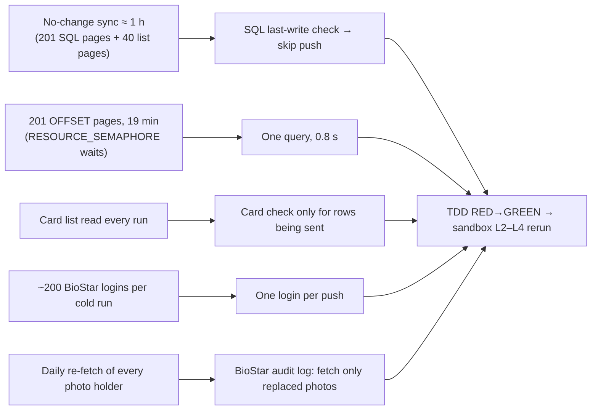

## DASMA sync: skip what didn't change — SQL skip check, one-query read, card checks only for sent rows, one BioStar login, audit-log photo detection

**TL;DR.** Think of a librarian who re-reads every book on the shelf, page by page, just to
find the one that got a new sticker.
- The SQL Server roster is read in 201 slices, and each slice makes SQL Server re-sort all
  20,000 rows.
- BioStar is logged into about 200 times.
- Every photo holder is re-fetched daily.

The fix:
1. Ask SQL Server "was anything written since last time?" (0.15 s). If not, skip the push.
2. Otherwise read the table once (0.8 s instead of 19 minutes).
3. Look up cards only for rows actually being sent, with one BioStar login per push.
4. Find replaced photos from BioStar's own audit log instead of re-reading everyone daily.

Gate access behaves exactly as before.

### Flowchart (high-level)



### Task metadata

- **Classification:** `PERFORMANCE` (+ enhancement) · Deep · database-sync (Dasma path) · High.
- **Docs loaded:** `planning.md, plan-template.md` (+ `PLANNING_STANDARDS.md`, `AI_WORKFLOW.md`, `AGENTS.md`, `CLAUDE.md`).

**Measured bottlenecks (baseline).** All from sandbox job `manual-30` (L1, cold 20k, 81 min)
and `manual-31` (L2, a no-change run, stopped at 32 min).

| Cost | Measurement | Sample | What it divides by |
|---|---|---|---|
| Source read | `timingsMs.sourceRead` = 1,160,725 ms | 201 queries | per query 5.8 s mean. 12.8 of the 19.3 min fell in the 3:22–4:00 slow window, which is reported apart |
| SQL waits | `sys.dm_exec_requests` showed `RESOURCE_SEMAPHORE` (memory grant) at `OFFSET 3300`, 22 s+ per page | SQL Express host | — |
| One-query alternatives (read-only, 16:4x) | whole-table `SELECT` 795 ms; `dm_db_index_usage_stats.last_user_update` 148 ms | one shot each, warm | the whole-table read is warm; the first cold run is reported from the rerun |
| BioStar list read in L2 | 18 min for 40 pages | during the slow period | the same read took 64 s at 4:11 PM |
| BioStar logins | one per upload attempt (D:1949) + per list read + per sweep | ≈ 203 in L1 | counted from code paths |
| Deep pass | re-fetches every photo holder when `lastFullSyncAt` is older than 24 h | D:184-188 | up to 19,600 detail requests per day at 20k |

**Claims reversed while investigating:**
- **"BioStar slows as its user count grows."** Refuted: batches 176–201, at 17k–19.6k users,
  were back to 14 s.
- **"Stamp `remarks_checked_at` when a row is delivered."** Dropped. An empty remark cell
  doesn't clear a BioStar custom field, so stamping would hide a stale BioStar remark.
- **"Share one list read between push and pull."** Dropped. After this plan the push reads
  the list only for bulk changes, so there's nothing left to share.

**Causal claims (evidence gate):**

| Claim | Evidence for | Would be falsified by |
|---|---|---|
| OFFSET paging drove the 19-min source read | `RESOURCE_SEMAPHORE` on every sampled page; the one-query read took 0.8 s | the rerun's one-query `sourceRead` being comparable to 19 min |
| The skip check is safe | any write moves `last_user_update`; NULL (after a restart, or without permission) means "read" | a row changing without `last_user_update` moving, which L3's mutation checks |

**UNVERIFIED items that the design does not depend on:**
- **Production login permission.** Whether DLSU's production SQL login has `VIEW SERVER STATE`
  is unknown. Without it the check returns NULL and the push always reads (0.8 s).
- **Audit coverage.** Only photos uploaded through the admin app or API are in scope (Romeo,
  2026-09-23). Verified: `audit.user.photo` rows exist for 91000001 and 91000002.

**Other metadata:**
- **Gate-access invariants:**
  - (1) `studentMutationLock`: unchanged. The skip path runs inside it and returns early.
  - (2) No blanked card: a row is only sent with an empty `csn` after `resolveCsn` answered
    (directory card_count 0 / absent, or a definitive 400/404). Unchanged rows aren't sent,
    so they can't blank anything.
  - (3) Roles and (4) `reports`: not touched.
- **Detected running model:** Claude Opus 5.5 (`claude-opus-5-5`).
- **Recommended model:** `opus`, high, for every phase (no switch stop). Fallback: `sonnet`,
  high.
- **Branch:** `perf/no-ticket-dasma-sync-skip-unchanged`, from `origin/main`.
- **Release path:** one branch → one PR into `main`, merge commit. Romeo may again direct a
  local merge.
- **Persona rounds:** `.claude/agents/` personas aren't registered in this session, so the
  main session adopts the roles in sequence: test-engineer, then nestjs-backend-dev, then
  code-reviewer and security-auditor.
- **Graphify:** skipped by Romeo's instruction on 2026-09-23 (setup incomplete). Discovery used
  grep and direct reads.
- **Migration deviation, flagged for approval:**
  - Pre-migration, TypeORM selects of the 2 new entity columns fail, so the sync errors.
  - The supported deploy path (`deploy-monorepo.bat` runs `migrate:backend` before start)
    always applies the migration first.
  - Same pattern as `1780000003000`.
- **Execution preflight:** `git fetch origin`, then
  `git show origin/main:scripts/new-task-worktree.sh | sh -s perf dasma-sync-skip-unchanged`.
  The primary checkout is on `main`, so `scripts/new-task-worktree.sh` exists locally too.

Paths: `D` = `apps/backend/src/database-sync/services/database-sync-dasma-path.service.ts`,
`B` = `apps/backend/src/database-sync/services/shared/biostar-api.service.ts`,
`PS` = `apps/backend/src/database-sync/services/database-sync-dasma-path.service.spec.ts`,
`BS` = `apps/backend/src/database-sync/services/shared/biostar-api.service.spec.ts`,
`CS` = `apps/backend/src/database-sync/services/database-sync-dasma-csv.spec.ts`,
`E2E` = `apps/backend/test/dasma-sync-biostar.e2e-spec.ts`,
`FB` = `apps/backend/test/fake-biostar-server.ts`.

---

### Phase 1 — Worktree + plan copy (`opus`, high)

```bash
cd /Users/romeoangelesjr/Documents/meraki/dlsu-gate-system-portal && git fetch origin && sh scripts/new-task-worktree.sh perf dasma-sync-skip-unchanged
```

Inside `.claude/worktrees/perf-dasma-sync-skip-unchanged`:
1. Link `apps/backend/logs` to the primary checkout's `apps/backend/logs`, the same way as last
   task: `ln -s <primary>/apps/backend/logs apps/backend/logs`.
2. Copy this plan to `docs/plans/dasma-sync-skip-unchanged.md` and commit:
   `docs(plans): DASMA sync skip-unchanged and audit photo detection`.

### Phase 2 — RED (`opus`, high)

**2a. Fakes (test doubles).** The source is now one query with no `FETCH`.

In `CS` and in `E2E`, Old:
`          const size = Number(text.match(/FETCH NEXT (\d+) ROWS/)?.[1] ?? 500);`
New:
`          const size = Number(text.match(/FETCH NEXT (\d+) ROWS/)?.[1] ?? sourceRows.length);`

In `FB`, Old:

```ts
  errorCsv?: string;
```

New:

```ts
  errorCsv?: string;
  /** Rows served by POST /api/audit/search. Default: none. */
  auditRows?: Record<string, unknown>[];
```

Old:

```ts
    // --- user list -----------------------------------------------------
```

New:

```ts
    // --- audit log -----------------------------------------------------
    if (method === 'POST' && url.startsWith('/api/audit/search')) {
      this.json(res, 200, {
        AuditCollection: { rows: this.scenario.auditRows ?? [] },
        Response: { code: '0' },
      });
      return;
    }

    // --- user list -----------------------------------------------------
```

**2b. Existing tests whose premise changes** (`PS`):
- In each of these three tests, insert `      CONFIG.BIOSTAR_CARD_DIRECTORY_MIN_ROWS = '0';` as the first
  line of the body:
  - `it('edge: looks up only a listed user whose card PostgreSQL does not hold', async () => {`
  - `it('regression: a roster BioStar does not hold yet costs no per-user request', async () => {`
  - `it('regression: the remark sweep stamps a user BioStar does not hold without asking', async () => {`
- In `it('regression: logs in for a card lookup only when a batch needs one'`, Old:

```ts
      // One login for the user list, one per upload; none for card lookups.
      expect(biostarApi.getApiToken).toHaveBeenCalledTimes(4);
```

New:

```ts
      // One login for the whole push: uploads reuse it, card lookups too.
      expect(biostarApi.getApiToken).toHaveBeenCalledTimes(1);
```

In `E2E`, Old:

```ts
  it('regression: enrolling a new roster asks BioStar nothing per user', async () => {
    await service.executeDatabaseSync('e2e-1');
```

New:

```ts
  it('regression: enrolling a new roster asks BioStar nothing per user', async () => {
    service = await makeService({ BIOSTAR_CARD_DIRECTORY_MIN_ROWS: '0' });
    await service.executeDatabaseSync('e2e-1');
```

Old:

```ts
    it('re-reads every candidate on the periodic deep pass', async () => {
      biostar.listPages = [{ total: 1, rows: [listRow()] }];
```

New:

```ts
    it('re-reads every candidate on the periodic deep pass', async () => {
      service = await makeService({ BIOSTAR_FULL_SYNC_INTERVAL_HOURS: '24' });
      biostar.listPages = [{ total: 1, rows: [listRow()] }];
```

**2c. New tests.**

In `PS`, directly above the line
`  // The card must never be blanked, and must never be re-fetched forever` and its preceding
`  // ===…` line, insert:

```ts
  // =====================================================================
  // Fewer calls per sync — measured on the 2026-09-23 stress run
  // =====================================================================
  describe('Fewer calls per sync', () => {
    const queriesSeen: string[] = [];
    const poolAnswering = (lastWrite: string | null) => ({
      request: () => {
        const req = {
          input: () => req,
          query: jest.fn(async (text: string) => {
            queriesSeen.push(text);
            if (text.includes('dm_db_index_usage_stats')) {
              return { recordset: [{ lastWrite }] };
            }
            if (text.includes('sys.columns')) {
              return { recordset: [{ count: 1 }] };
            }
            const offset = Number(text.match(/OFFSET (\d+) ROWS/)?.[1] ?? 0);
            const size = Number(
              text.match(/FETCH NEXT (\d+) ROWS/)?.[1] ?? sourceRows.length,
            );
            return {
              recordset: sourceRows
                .slice(offset, offset + size)
                .map((row) => ({ ...row })),
            };
          }),
        };
        return req;
      },
      close: jest.fn(async () => undefined),
    });
    const sourceReads = () =>
      queriesSeen.filter((q) => q.includes('FROM dbo.FakeRoster')).length;
    const importCalls = () =>
      (axios.post as jest.Mock).mock.calls.filter(([url]) =>
        String(url).includes('/api/users/csv_import'),
      ).length;
    const diag = () =>
      (fsMock.writeFileSync as jest.Mock).mock.calls
        .filter(([p]) => String(p).includes('diagnostics'))
        .map(([, body]) => JSON.parse(String(body)))
        .at(-1);
    const cursor = () =>
      biostarState as BiostarSyncState & { sourceLastWrite?: string | null };
    const threeRows = () => [
      sourceRow({ ID: '12100001' }),
      sourceRow({ ID: '12100002' }),
      sourceRow({ ID: '12100003' }),
    ];
    const WRITE = '2026-09-23T14:01:25.497';

    beforeEach(() => {
      queriesSeen.length = 0;
    });

    it('error: reads the source when SQL Server cannot say when it was last written', async () => {
      (sql.connect as jest.Mock).mockResolvedValue(poolAnswering(null));
      sourceRows = [sourceRow({ ID: '12100001' })];
      setClock('2026-08-26T08:00:00+08:00');

      await service.executeDatabaseSync('run-1');

      expect(sourceReads()).toBe(1);
      expect(latestCsv().map((r) => r.user_id)).toEqual(['12100001']);
    });

    it('edge: pushes while a remark clear is pending even if the source is unchanged', async () => {
      (sql.connect as jest.Mock).mockResolvedValue(poolAnswering(WRITE));
      cursor().sourceLastWrite = WRITE;
      studentRepo.rows.push({
        ID_Number: '12100009',
        Remarks: null,
        remarks_clear_pending: true,
        isArchived: false,
        Campus_Entry: 'Y',
      } as Student);
      sourceRows = [sourceRow({ ID: '12100001' })];
      setClock('2026-08-26T08:00:00+08:00');

      await service.executeDatabaseSync('run-1');

      expect(sourceReads()).toBe(1);
    });

    it('regression: skips the push when the source was not written since the last clean sync', async () => {
      (sql.connect as jest.Mock).mockResolvedValue(poolAnswering(WRITE));
      sourceRows = [sourceRow({ ID: '12100001' })];
      setClock('2026-08-26T08:00:00+08:00');
      await service.executeDatabaseSync('run-1');
      expect(cursor().sourceLastWrite).toBe(WRITE);

      queriesSeen.length = 0;
      const importsBefore = importCalls();
      setClock('2026-08-27T08:00:00+08:00');
      await service.executeDatabaseSync('run-2');

      expect(sourceReads()).toBe(0);
      expect(importCalls()).toBe(importsBefore);
      expect(diag().skippedUnchangedSource).toBe(true);
    });

    it('regression: forgets the source snapshot after a run that halted uploads', async () => {
      (sql.connect as jest.Mock).mockResolvedValue(poolAnswering(WRITE));
      cursor().sourceLastWrite = 'an older write';
      (axios.post as jest.Mock).mockImplementation(async (url: string) => {
        if (url.includes('/api/attachments')) {
          return { data: { filename: 'fake-upload.csv' } };
        }
        if (url.includes('/api/users/csv_import')) {
          return { data: { Response: { code: '4', task_id: '1470' } } };
        }
        return { data: {} };
      });
      sourceRows = [sourceRow({ ID: '12100001' })];
      setClock('2026-08-26T08:00:00+08:00');

      await service.executeDatabaseSync('run-1');

      expect(cursor().sourceLastWrite ?? null).toBeNull();
    });

    it('regression: reads the whole source in one query, then imports it in pages', async () => {
      (sql.connect as jest.Mock).mockResolvedValue(poolAnswering(null));
      CONFIG.BIOSTAR_IMPORT_MAX_ROWS = '2';
      sourceRows = [
        ...threeRows(),
        sourceRow({ ID: '12100004' }),
        sourceRow({ ID: '12100005' }),
      ];
      setClock('2026-08-26T08:00:00+08:00');

      await service.executeDatabaseSync('run-1');

      expect(sourceReads()).toBe(1);
      expect(importCalls()).toBe(3);
    });

    it('regression: orders the source by every column so a duplicated ID resolves the same way', async () => {
      (sql.connect as jest.Mock).mockResolvedValue(poolAnswering(null));
      sourceRows = [sourceRow({ ID: '12100001' })];
      setClock('2026-08-26T08:00:00+08:00');

      await service.executeDatabaseSync('run-1');

      expect(
        queriesSeen.find((q) => q.includes('FROM dbo.FakeRoster')),
      ).toContain(
        'ORDER BY ID, LastName, FirstName, MiddleName, Suffix, [Group], Status, Remarks, IsArchived',
      );
    });

    it('regression: looks up a card only for a row that is about to be sent', async () => {
      (sql.connect as jest.Mock).mockResolvedValue(poolAnswering(null));
      sourceRows = threeRows();
      setClock('2026-08-26T08:00:00+08:00');
      await service.executeDatabaseSync('run-1');

      (biostarApi.fetchBiostarUserDetail as jest.Mock).mockClear();
      sourceRows = [
        sourceRow({ ID: '12100001' }),
        sourceRow({ ID: '12100002', FirstName: 'Maria' }),
        sourceRow({ ID: '12100003' }),
      ];
      setClock('2026-08-27T08:00:00+08:00');
      await service.executeDatabaseSync('run-2');

      expect(
        (biostarApi.fetchBiostarUserDetail as jest.Mock).mock.calls.map(
          ([id]) => id,
        ),
      ).toEqual(['12100002']);
    });

    it('regression: logs in to BioStar once per push', async () => {
      (sql.connect as jest.Mock).mockResolvedValue(poolAnswering(null));
      CONFIG.BIOSTAR_IMPORT_MAX_ROWS = '1';
      sourceRows = threeRows();
      setClock('2026-08-26T08:00:00+08:00');

      await service.executeDatabaseSync('run-1');

      expect(biostarApi.getApiToken).toHaveBeenCalledTimes(1);
    });
  });

```

At the end of `BS`, append:

```ts
describe('BiostarApiService.listAuditPhotoChanges', () => {
  type AuditReader = {
    listAuditPhotoChanges(
      token: string,
      sessionId: string,
      since: Date,
      until: Date,
    ): Promise<Set<string> | null>;
  };
  let reader: AuditReader;

  beforeEach(async () => {
    jest.clearAllMocks();
    const module: TestingModule = await Test.createTestingModule({
      providers: [
        BiostarApiService,
        {
          provide: ConfigService,
          useValue: {
            get: jest.fn(
              (key: string) =>
                ({
                  BIOSTAR_API_BASE_URL: 'https://biostar.fake',
                  BIOSTAR_API_LOGIN_ID: 'fake',
                  BIOSTAR_API_PASSWORD: 'fake',
                })[key],
            ),
          },
        },
      ],
    }).compile();
    reader = module.get(BiostarApiService) as unknown as AuditReader;
  });

  const since = new Date('2026-09-23T04:00:00.000Z');
  const until = new Date('2026-09-23T05:00:00.000Z');
  const auditPage = (rows: Record<string, unknown>[]) => ({
    data: { AuditCollection: { rows } },
  });

  it('error: returns null when the audit log cannot be read', async () => {
    (axios.post as jest.Mock).mockRejectedValueOnce(new Error('socket hang up'));

    await expect(
      reader.listAuditPhotoChanges('t0ken', 's3ss10n', since, until),
    ).resolves.toBeNull();
  });

  it('edge: reads the user id from the last parentheses, whatever the name holds', async () => {
    (axios.post as jest.Mock).mockResolvedValueOnce(
      auditPage([
        { CONTENT: 'audit.user.photo', TARGET: 'Cruz (Jr)(91000001)' },
      ]),
    );

    await expect(
      reader.listAuditPhotoChanges('t0ken', 's3ss10n', since, until),
    ).resolves.toEqual(new Set(['91000001']));
  });

  // Measured live 2026-09-23: our own imports and remark edits share the
  // user menu; only a photo change may send the pull to fetch a detail.
  it('regression: ignores imports and changes that are not photos', async () => {
    (axios.post as jest.Mock).mockResolvedValueOnce(
      auditPage([
        { CONTENT: 'audit.user.csv_import', TARGET: 'sync_batch1.csv' },
        { CONTENT: 'audit.user.user_custom_fields', TARGET: 'Santos Juan(91000003)' },
        {
          CONTENT: 'audit.user.photo|audit.user.user_custom_fields',
          TARGET: 'Santos Juan(91000002)',
        },
      ]),
    );

    await expect(
      reader.listAuditPhotoChanges('t0ken', 's3ss10n', since, until),
    ).resolves.toEqual(new Set(['91000002']));
  });

  it('happy: asks for user changes in the window, page by page, in the format BioStar accepts', async () => {
    const first = Array.from({ length: 500 }, (_, i) => ({
      CONTENT: 'audit.user.photo',
      TARGET: `User(${9100000 + i})`,
    }));
    (axios.post as jest.Mock)
      .mockResolvedValueOnce(auditPage(first))
      .mockResolvedValueOnce(
        auditPage([{ CONTENT: 'audit.user.photo', TARGET: 'Last(91200000)' }]),
      );

    const ids = await reader.listAuditPhotoChanges(
      't0ken',
      's3ss10n',
      since,
      until,
    );

    expect(ids?.size).toBe(501);
    const [firstUrl, firstBody] = (axios.post as jest.Mock).mock.calls[0];
    expect(firstUrl).toBe('https://biostar.fake/api/audit/search');
    expect(firstBody.Query.conditions).toEqual([
      { column: 'MENU', operator: 0, values: ['user'] },
      {
        column: 'DATE',
        operator: 3,
        values: ['2026-09-23T04:00:00.00Z', '2026-09-23T05:00:00.00Z'],
      },
    ]);
    expect((axios.post as jest.Mock).mock.calls[1][1].Query.offset).toBe(500);
  });
});
```

In `E2E`, directly before `    it('re-reads every candidate on the periodic deep pass', async () => {`, insert:

```ts
    // Replaced in the BioStar admin app: photo_exists stays true and nothing
    // else on the list moves. BioStar's audit log is what names the user.
    it('regression: fetches a photo the audit log says was replaced, when nothing else moved', async () => {
      biostar.listPages = [{ total: 1, rows: [listRow()] }];
      biostar.userDetails['12100001'] = {
        user_id: '12100001',
        photo: '/9j/OLD',
        cards: [{ card_id: '5551234' }],
      };
      await service.syncFromBiostar('e2e-audit-1');
      expect((await byId('12100001')).Photo).toBe('/9j/OLD');

      biostar.userDetails['12100001'] = {
        user_id: '12100001',
        photo: '/9j/NEW',
        cards: [{ card_id: '5551234' }],
      };
      biostar.scenario.auditRows = [
        {
          MENU: 'audit.menu.user',
          METHOD: 'audit.method.3',
          CONTENT: 'audit.user.photo',
          TARGET: 'Dela Cruz, Juan(12100001)',
        },
      ];
      await service.syncFromBiostar('e2e-audit-2');

      expect((await byId('12100001')).Photo).toBe('/9j/NEW');
    }, 90000);

    it('regression: does not re-read every photo holder once a day unless configured', async () => {
      biostar.listPages = [{ total: 1, rows: [listRow()] }];
      biostar.userDetails['12100001'] = {
        user_id: '12100001',
        photo: '/9j/SETTLED',
        cards: [{ card_id: '5551234' }],
      };
      await service.syncFromBiostar('e2e-nodeep-1');
      expect(pulls('12100001')).toBe(1);

      const repo = dataSource.getRepository(BiostarSyncState);
      const row = await state();
      row.lastFullSyncAt = new Date(Date.now() - 48 * 3600 * 1000);
      await repo.save(row);
      await service.syncFromBiostar('e2e-nodeep-2');

      expect(pulls('12100001')).toBe(1);
    }, 90000);

```

**2d. RED run.**

```bash
npm run tdd:red
```

Then:

```bash
cd apps/backend && TZ=Asia/Manila npx jest --config ./test/jest-e2e.json
```

**Must fail:**
- `PS`: `error: reads the source…`, `edge: pushes while…`, `regression: skips the push…`,
  `regression: reads the whole source…`, `regression: orders the source…`,
  `regression: looks up a card only…`, `regression: logs in to BioStar once per push`, and the
  edited `regression: logs in for a card lookup only…`.
- `BS`: all 4 new tests.
- `E2E`: the 2 new tests.

**May pass:** `regression: forgets the source snapshot…` (pre-fix code never sets it).

**Any other failure: stop and report.** Commit:
`test(dasma): RED for skip-unchanged, one-query read, sent-only card checks, one login, audit photos`.

### Phase 3 — GREEN (`opus`, high)

**3a. Migration.** New file
`apps/backend/src/migrations/1780000004000-AddSyncCursorsToBiostarSyncState.ts`:

```ts
import { MigrationInterface, QueryRunner } from 'typeorm';

/**
 * Two cursors for the DASMA sync, both "unknown" when NULL.
 *
 * - `sourceLastWrite`: SQL Server's own last-write time for the source table,
 *   recorded after a clean push. While it has not moved, a push has nothing
 *   to read. NULL means "read the source" — what every existing row gets.
 * - `lastAuditAt`: where the last clean pull stopped reading BioStar's audit
 *   log for replaced photos. NULL means the next pull starts the window.
 *
 * Additive only.
 */
export class AddSyncCursorsToBiostarSyncState1780000004000
  implements MigrationInterface
{
  name = 'AddSyncCursorsToBiostarSyncState1780000004000';

  public async up(queryRunner: QueryRunner): Promise<void> {
    await queryRunner.query(
      `ALTER TABLE "biostar_sync_state" ADD COLUMN IF NOT EXISTS "sourceLastWrite" varchar NULL`,
    );
    await queryRunner.query(
      `ALTER TABLE "biostar_sync_state" ADD COLUMN IF NOT EXISTS "lastAuditAt" TIMESTAMP NULL`,
    );
  }

  public async down(queryRunner: QueryRunner): Promise<void> {
    await queryRunner.query(
      `ALTER TABLE "biostar_sync_state" DROP COLUMN IF EXISTS "lastAuditAt"`,
    );
    await queryRunner.query(
      `ALTER TABLE "biostar_sync_state" DROP COLUMN IF EXISTS "sourceLastWrite"`,
    );
  }
}
```

**3b. Entity** `apps/backend/src/database-sync/entities/biostar-sync-state.entity.ts`. Old:

```ts
  @Column({ type: 'text', nullable: true })
  lastError: string | null;
```

New:

```ts
  @Column({ type: 'text', nullable: true })
  lastError: string | null;

  /** SQL Server's last write to the source at the last clean push. */
  @Column({ type: 'varchar', nullable: true })
  sourceLastWrite: string | null;

  /** End of the BioStar audit-log window read by the last clean pull. */
  @Column({ type: 'timestamp', nullable: true })
  lastAuditAt: Date | null;
```

**3c. `B`.** Old:

```ts
  getApiBaseUrl(): string {
```

New:

```ts
  /**
   * user_ids whose photo was changed between `since` and `until`, read from
   * BioStar's own audit log in one paged query.
   *
   * Measured on the sandbox 2026-09-23: a photo uploaded through the admin
   * app or the API is logged under the user menu with CONTENT containing
   * `audit.user.photo` and TARGET `Name(user_id)`. Returns null when the log
   * cannot be read, so the caller keeps its list-based signals alone.
   */
  async listAuditPhotoChanges(
    token: string,
    sessionId: string,
    since: Date,
    until: Date,
  ): Promise<Set<string> | null> {
    const pageSize = 500;
    // The format BioStar accepted in the live probe: two fraction digits.
    const asBiostarDate = (d: Date) =>
      d.toISOString().replace(/\.\d{3}Z$/, '.00Z');
    const ids = new Set<string>();
    try {
      for (let offset = 0; ; offset += pageSize) {
        const response = await axios.post(
          `${this.apiBaseUrl}/api/audit/search`,
          {
            Query: {
              offset,
              limit: pageSize,
              conditions: [
                { column: 'MENU', operator: 0, values: ['user'] },
                {
                  column: 'DATE',
                  operator: 3,
                  values: [asBiostarDate(since), asBiostarDate(until)],
                },
              ],
              total: false,
            },
          },
          {
            headers: {
              'Content-Type': 'application/json',
              Authorization: `Bearer ${token}`,
              'bs-session-id': sessionId,
              accept: 'application/json',
            },
            httpsAgent: new https.Agent({ rejectUnauthorized: false }),
            timeout: 120000,
          },
        );
        const rows = (response.data?.AuditCollection?.rows ??
          []) as Record<string, unknown>[];
        for (const row of rows) {
          const content = String(row.CONTENT ?? '').split('|');
          if (!content.includes('audit.user.photo')) continue;
          const id = /\(([^()]+)\)\s*$/.exec(String(row.TARGET ?? ''))?.[1];
          if (id) ids.add(id);
        }
        if (rows.length < pageSize) return ids;
      }
    } catch (error) {
      this.logger.warn(
        `[Dasma Biostar] Could not read the audit log; photo replacements wait for the list signals: ${
          (error as Error)?.message ?? String(error)
        }`,
      );
      return null;
    }
  }

  getApiBaseUrl(): string {
```

**3d. `D` — module constants.** Old:

```ts
const CSV_IMPORT_TIMEOUT_MS = 10 * 60 * 1000;
```

New:

```ts
const CSV_IMPORT_TIMEOUT_MS = 10 * 60 * 1000;

/** The audit window reaches back this far past the last clean pull. */
const AUDIT_OVERLAP_MS = 5 * 60 * 1000;
```

**3e. `D` — pull.**

1. Old:

```ts
    /**
     * How stale a full pass may get before the next run is forced to be one.
     * `0` means every run walks the whole list.
     */
    const parsedFullSyncHours = parseInt(
      String(this.configService.get('BIOSTAR_FULL_SYNC_INTERVAL_HOURS') ?? ''),
      10,
    );
    const fullSyncIntervalHours =
      Number.isFinite(parsedFullSyncHours) && parsedFullSyncHours >= 0
        ? parsedFullSyncHours
        : 24;
```

New:

```ts
    /**
     * How stale a full pass may get before the next run is forced to be one.
     * `0` means every run walks the whole list. Unset means never: a replaced
     * photo is named by BioStar's audit log instead (see auditPhotoChanges).
     */
    const parsedFullSyncHours = parseInt(
      String(this.configService.get('BIOSTAR_FULL_SYNC_INTERVAL_HOURS') ?? ''),
      10,
    );
    const fullSyncIntervalHours: number | null =
      Number.isFinite(parsedFullSyncHours) && parsedFullSyncHours >= 0
        ? parsedFullSyncHours
        : null;
```

2. Old:

```ts
    const deepPass =
      fullSyncIntervalHours === 0 ||
      !state.lastFullSyncAt ||
      Date.now() - state.lastFullSyncAt.getTime() >=
        fullSyncIntervalHours * 3600 * 1000;
```

New:

```ts
    const deepPass =
      fullSyncIntervalHours !== null &&
      (fullSyncIntervalHours === 0 ||
        !state.lastFullSyncAt ||
        Date.now() - state.lastFullSyncAt.getTime() >=
          fullSyncIntervalHours * 3600 * 1000);
    // Signal three: photos replaced in the BioStar admin app, which the list
    // cannot show (photo_exists stays true). One paged audit query instead of
    // re-reading every photo holder.
    const auditUntil = new Date();
    const auditPhotoChanges = await this.loadAuditPhotoChanges(
      token,
      sessionId,
      state.lastAuditAt ?? null,
      auditUntil,
    );
```

3. Old:

```ts
          if (drifted && !changed) pageDriftReads++;
          return changed || drifted;
```

New:

```ts
          if (drifted && !changed) pageDriftReads++;
          const photoReplaced =
            auditPhotoChanges?.has(String(u.user_id)) === true;
          return changed || drifted || photoReplaced;
```

4. Old:

```ts
        state.lastModifiedCursor = maxLastModified;
        if (deepPass) {
```

New:

```ts
        state.lastModifiedCursor = maxLastModified;
        // Advance the audit window only when it was read, or never existed:
        // a failed read leaves the gap for the next run to cover.
        if (auditPhotoChanges !== null || !state.lastAuditAt) {
          state.lastAuditAt = auditUntil;
        }
        if (deepPass) {
```

5. Old:

```ts
        listNarrowedByLastModified: false,
```

New:

```ts
        listNarrowedByLastModified: false,
        // Users the audit log named as photo-replaced; null = not read.
        auditPhotoChanges:
          auditPhotoChanges === null ? null : auditPhotoChanges.size,
```

6. Old:

```ts
  /** Reads the run's card directory; null means "ask per user", as before. */
  private async loadCardDirectory(): Promise<Map<string, number> | null> {
    try {
      const { token, sessionId } = await this.biostarApiService.getApiToken();
```

New:

```ts
  /** Photo replacements since `since` from BioStar's audit log; null = unknown. */
  private async loadAuditPhotoChanges(
    token: string,
    sessionId: string,
    since: Date | null,
    until: Date,
  ): Promise<Set<string> | null> {
    if (!since) return null;
    try {
      return await this.biostarApiService.listAuditPhotoChanges(
        token,
        sessionId,
        new Date(since.getTime() - AUDIT_OVERLAP_MS),
        until,
      );
    } catch (error) {
      this.logger.warn(
        `[Dasma Biostar] Audit log unavailable: ${
          (error as Error)?.message ?? String(error)
        }`,
      );
      return null;
    }
  }

  /**
   * When SQL Server last saw a write to the source table, or null when it
   * cannot say — the DMV is empty after a restart, or the login lacks VIEW
   * SERVER STATE. Null always means "read the source": being wrong costs one
   * 0.8 s read, never a missed change.
   */
  private async readSourceLastWrite(
    pool: sql.ConnectionPool,
  ): Promise<string | null> {
    try {
      const result = await pool
        .request()
        .input('table', sql.NVarChar(256), this.configService.get('SOURCE_DB_TABLE'))
        .query(
          `SELECT CONVERT(varchar(33), MAX(last_user_update), 126) AS lastWrite
             FROM sys.dm_db_index_usage_stats
            WHERE database_id = DB_ID() AND object_id = OBJECT_ID(@table)`,
        );
      const value = result.recordset?.[0]?.lastWrite;
      return typeof value === 'string' && value !== '' ? value : null;
    } catch {
      return null;
    }
  }

  /** Reads the run's card directory; null means "ask per user", as before. */
  private async loadCardDirectory(
    session: () => Promise<{ token: string; sessionId: string }>,
  ): Promise<Map<string, number> | null> {
    try {
      const { token, sessionId } = await session();
```

**3f. `D` — push.**

1. Old:

```ts
      // One timestamp for the whole run. Every activation stamped by this sync
```

New:

```ts
      // Has anyone written to the source since the last clean push? One DMV
      // read (0.15 s on the sandbox) instead of reading every row. Pending
      // remark clears still need this run, so they always prevent a skip.
      const sourceLastWrite = await this.readSourceLastWrite(pool);
      const pushState = await this.getOrCreateBiostarSyncState();
      const clearsPending = await this.studentRepository.find({
        where: { remarks_clear_pending: true },
        select: ['ID_Number'],
        take: 1,
      });
      if (
        sourceLastWrite !== null &&
        pushState.sourceLastWrite === sourceLastWrite &&
        clearsPending.length === 0
      ) {
        this.logger.log(
          `[Dasma] Source unchanged since the last clean sync (${sourceLastWrite}); nothing to push`,
        );
        await this.commonService.writeSyncDiagnostics(jobName, {
          direction: 'sql-server-to-postgres-to-biostar',
          schemaEnv: 'dasma',
          skippedUnchangedSource: true,
          sourceLastWrite,
          timingsMs: { total: Date.now() - runStartMs },
        });
        return {
          success: true,
          message: 'Source unchanged; nothing to push',
          recordsProcessed: 0,
        };
      }

      // One timestamp for the whole run. Every activation stamped by this sync
```

2. Old:

```ts
      /** Changed rows held back because uploads were halted this run. */
      let rowsDeferredAfterHalt = 0;
```

New:

```ts
      /** Changed rows held back because uploads were halted this run. */
      let rowsDeferredAfterHalt = 0;
      /** Batches whose CSV never reached csv_import. */
      let uploadFailedBatches = 0;
```

3. Old:

```ts
      // Who BioStar holds and how many cards each has, read once per run.
      // Replaces a detail request per card-less row (about 6 a second; 20,000
      // per sync at DLSU's size). null = the list could not be read in full,
      // and every lookup below falls back to asking per user, as before.
      const cardDirectory = await this.loadCardDirectory();
```

New:

```ts
      // One BioStar login for the whole push. An upload retry logs in afresh
      // in case the session is what failed; everything else reuses it. The
      // 2026-09-23 cold run logged in about 200 times.
      let pushSessionPromise: Promise<{
        token: string;
        sessionId: string;
      }> | null = null;
      const pushSession = (renew = false) => {
        if (renew || !pushSessionPromise) {
          pushSessionPromise = this.biostarApiService.getApiToken();
        }
        return pushSessionPromise;
      };
      // BioStar's user list (500 users a page) is read at most once per push,
      // and only when more rows need a card check than it costs pages to read
      // (40 at 20k users; 50 chosen above that). undefined = not read yet;
      // null = could not be read in full, so lookups go per user.
      let cardDirectory: Map<string, number> | null | undefined;
      const parsedDirectoryMin = parseInt(
        String(this.configService.get('BIOSTAR_CARD_DIRECTORY_MIN_ROWS') ?? ''),
        10,
      );
      const cardDirectoryMinRows =
        Number.isFinite(parsedDirectoryMin) && parsedDirectoryMin >= 0
          ? parsedDirectoryMin
          : 50;
```

4. Old:

```ts
        const csnStart = Date.now();
        // Logged in only if a row in this batch really needs a lookup; with the
        // card directory most batches need none.
        let csnSessionPromise: Promise<{
          token: string;
          sessionId: string;
        }> | null = null;
        const csnSession = () =>
          (csnSessionPromise ??= this.biostarApiService.getApiToken());
        const csnRateLimitTracker = { count: 0 };
```

New:

```ts
        const csnStart = Date.now();
        const csnRateLimitTracker = { count: 0 };
```

5. Old (the whole current block):

```ts
        const toResolveCsn = validatedRows.filter(
          (row): row is DasmaCsvRowInput => row !== null,
        );

        /** Cards learned from BioStar this batch, to write back once. */
        const csnToPersist: { userId: string; csn: string }[] = [];
        const resolvedRows = await this.commonService.runWithConcurrency(
          toResolveCsn,
          csnConcurrency,
          async ({
            userId,
            rowBase,
          }): Promise<{
            row: Record<string, string>;
            unresolved: boolean;
          }> => {
            const { csn, unresolved, fetched, lookedUp } =
              await this.resolveDasmaCsnForCsvRow(
                userId,
                existingMap.get(userId),
                csnSession,
                csnRateLimitTracker,
                cardDirectory,
              );
            if (lookedUp) csnApiLookups++;
            if (fetched) {
              csnToPersist.push({ userId, csn });
            }
            return { row: { ...rowBase, csn }, unresolved };
          },
        );
```

New:

```ts
        // A row whose content has not changed is not sent, and a row that is
        // not sent cannot blank anyone's card — so the card is looked up only
        // for rows about to go out without one stored. Rendering with the
        // stored card first is what makes that ordering possible: an unchanged
        // person renders exactly what was last delivered.
        const withStoredCsn = validatedRows
          .filter((row): row is DasmaCsvRowInput => row !== null)
          .map(({ userId, rowBase }) => ({
            userId,
            row: {
              ...rowBase,
              csn:
                this.normalizeUniqueIdValue(
                  existingMap.get(userId)?.Unique_ID,
                ) ?? '',
            },
          }));
        const needsCard = withStoredCsn.filter(
          ({ userId, row }) =>
            row.csn === '' &&
            existingMap.get(userId)?.biostar_row_hash !==
              this.hashCsvRow(row, dasmaHeaders),
        );
        const useDirectory = needsCard.length > cardDirectoryMinRows;
        if (useDirectory && cardDirectory === undefined) {
          cardDirectory = await this.loadCardDirectory(pushSession);
        }

        /** Cards learned from BioStar this batch, to write back once. */
        const csnToPersist: { userId: string; csn: string }[] = [];
        const cardAnswers = new Map<
          string,
          { csn: string; unresolved: boolean }
        >();
        await this.commonService.runWithConcurrency(
          needsCard,
          csnConcurrency,
          async ({ userId }) => {
            const { csn, unresolved, fetched, lookedUp } =
              await this.resolveDasmaCsnForCsvRow(
                userId,
                existingMap.get(userId),
                pushSession,
                csnRateLimitTracker,
                useDirectory ? (cardDirectory ?? null) : null,
              );
            if (lookedUp) csnApiLookups++;
            if (fetched) {
              csnToPersist.push({ userId, csn });
            }
            cardAnswers.set(userId, { csn, unresolved });
          },
        );
        const resolvedRows = withStoredCsn.map(({ userId, row }) => {
          const answer = cardAnswers.get(userId);
          return answer
            ? { row: { ...row, csn: answer.csn }, unresolved: answer.unresolved }
            : { row, unresolved: false };
        });
```

6. Old:

```ts
          failedRecordsAll.push({
            batchNumber,
            error: 'CSV file not created or empty',
```

New:

```ts
          uploadFailedBatches++;
          failedRecordsAll.push({
            batchNumber,
            error: 'CSV file not created or empty',
```

7. Old:

```ts
              failedRecordsAll.push({
                batchNumber,
                error: 'CSV upload failed after all retries',
```

New:

```ts
              uploadFailedBatches++;
              failedRecordsAll.push({
                batchNumber,
                error: 'CSV upload failed after all retries',
```

8. Old:

```ts
            const { token, sessionId } =
              await this.biostarApiService.getApiToken();
            const apiBaseUrl = this.biostarApiService.getApiBaseUrl();
            const uploadFormData = new FormData();
```

New:

```ts
            const { token, sessionId } = await pushSession(retries < 3);
            const apiBaseUrl = this.biostarApiService.getApiBaseUrl();
            const uploadFormData = new FormData();
```

9. Old:

```ts
      const sweptThisRun = await this.sweepUncheckedRemarks(
        jobName,
        cardDirectory,
      );
```

New:

```ts
      const sweptThisRun = await this.sweepUncheckedRemarks(
        jobName,
        cardDirectory ?? null,
        pushSession,
      );
```

10. Old:

```ts
      const scheduleNumber = parseInt(jobName.replace('sync-', ''));
```

New:

```ts
      // Remember the source snapshot only when every changed row reached
      // BioStar or was definitively rejected by it; anything that may still
      // need sending keeps the next run from skipping.
      const pushClean =
        biostarUploadsHalted === null &&
        partialImportUnparsed.length === 0 &&
        csnUnresolvedAll.length === 0 &&
        uploadFailedBatches === 0 &&
        csvImportOutcomes.every(
          (o) => o.outcome === 'success' || o.outcome === 'partial',
        );
      pushState.sourceLastWrite = pushClean ? sourceLastWrite : null;
      await this.biostarSyncStateRepository.save(pushState);

      const scheduleNumber = parseInt(jobName.replace('sync-', ''));
```

11. Sweep. Old:

```ts
    cardDirectory: Map<string, number> | null,
  ): Promise<number> {
```

New:

```ts
    cardDirectory: Map<string, number> | null,
    session: () => Promise<{ token: string; sessionId: string }>,
  ): Promise<number> {
```

Old:

```ts
      let session: { token: string; sessionId: string } | null = null;
      const rateLimitTracker = { count: 0 };
```

New:

```ts
      const rateLimitTracker = { count: 0 };
```

Old:

```ts
        session ??= await this.biostarApiService.getApiToken();
        const { token, sessionId } = session;
```

New:

```ts
        const { token, sessionId } = await session();
```

12. Old: the whole `private async *fetchBatches(` method, from its signature through its closing
    `  }` (the current D:2557–2596, starting `  private async *fetchBatches(` and ending
    `      offset += batchSize;\n    }\n  }`). New:

```ts
  /**
   * The whole source in one query, then handed out in import-sized pages.
   *
   * OFFSET paging made SQL Server sort the entire table once per page: 201
   * sorts for 20,000 rows, each queueing for a memory grant
   * (RESOURCE_SEMAPHORE) on the sandbox's SQL Express — 19 minutes of an
   * 81-minute run on 2026-09-23, where one query reads the same rows in
   * 0.8 s. Ordering by every column, not ID alone, makes a duplicated ID
   * resolve to the same winner on every run.
   */
  private async *fetchBatches(
    pool: sql.ConnectionPool,
    hasIsArchivedColumn: boolean,
    batchSize: number,
    timingsMs: Record<string, number>,
  ) {
    void hasIsArchivedColumn; // both table shapes select the same columns
    const tableName = this.configService.get('SOURCE_DB_TABLE');
    const columns =
      'ID, LastName, FirstName, MiddleName, Suffix, [Group], Status, Remarks, IsArchived';
    const queryStart = Date.now();
    const result = await pool
      .request()
      .query(`SELECT ${columns} FROM ${tableName} ORDER BY ${columns}`);
    this.commonService.addElapsed(timingsMs, 'sourceRead', queryStart);
    const rows = result.recordset;
    for (
      let i = 0, batchNumber = 1;
      i < rows.length;
      i += batchSize, batchNumber++
    ) {
      yield { batchRecords: rows.slice(i, i + batchSize), batchNumber };
    }
  }
```

**3g. Docs row.** In `docs/ai/dev-environment.md`, directly after the `BIOSTAR_IMPORT_MAX_ROWS` row,
insert:

```
| `BIOSTAR_CARD_DIRECTORY_MIN_ROWS` | rows needing a card check before the push reads the whole BioStar list instead of asking per user (default 50) | Optional | tuning | tuning | database-sync Dasma path |
| `BIOSTAR_FULL_SYNC_INTERVAL_HOURS` | hours between full photo re-reads; unset = never (audit log names replaced photos) | Optional | tuning | tuning | database-sync Dasma path |
```

**3h.** Format the changed files, then commit:

```bash
npx prettier --write <changed files>
```

Commit message:
`perf(dasma): skip unchanged syncs, read the source once, check cards only for sent rows, one BioStar login, audit-log photos`.

### Phase 4 — Validation (`opus`, high)

1. Type-check, lint and unit tests:

```bash
cd apps/backend && npx tsc --noEmit && npx eslint src/database-sync test && TZ=Asia/Manila npx jest
```

Expected: all pass, **318** (306 + 8 `PS` + 4 `BS`).

2. e2e tests:

```bash
TZ=Asia/Manila npx jest --config ./test/jest-e2e.json
```

Expected: **45 passed**. The e2e run also applies the migration through `migrationsRun`.

3. Migration up and down, local database only:

```bash
cd apps/backend && npm run migration:run && npm run migration:revert && npm run migration:run
```

This is the manual check behind `Migration-Waiver:`.

4. Soak and replay:

```bash
bun --cwd apps/backend scripts/scenario/photo-soak.ts 40 && bun --cwd apps/backend scripts/scenario/biostar-replay.ts
```

Expected: both end in `PASS`.

5. Build and TDD gate:

```bash
bun run build:backend && npm run tdd:gate
```

The PR body includes the `Migration-Waiver:` line.

### Phase 5 — Sandbox rerun (`opus`, high)

Run the backend from the worktree (or from `main` after the merge, if Romeo directs a local
merge). The migration applies on start. Then run L2–L4 through the portal, with `stress-watch`
and `stress-check` as before.

**L2 (no change), first run:**
- The push reads the source once, because no snapshot is stored yet.
  `push.timingsMs.sourceRead` must be under 5,000 ms, and `push.rowsEmitted` 1 (`9100ABC1`).
- `push.csnApiLookups` 0.
- The pull diag shows `auditPhotoChanges` as `null` on this first run, then a number after.

**L2, second run:** `push.skippedUnchangedSource` = true. The push takes under 2 s.

**L3 (`stress-mutate`, 100 rows):**
- `push.rowsEmitted` = 101.
- `push.emittedEqualsMutatedPlus9100ABC1` = true.
- `push.csnApiLookups` ≤ 100 (per user, since 100 > 50 uses the directory: 1 list read).
- `biostar.nameMutated` = 100.

**L4 (`stress-clear-hashes`):** converges as in L1, with `sourceRead` under 5 s.

**Photo check:**
1. Upload 1 photo to an existing 912 user in the BioStar admin app (Romeo), or by API PUT,
   logged.
2. Run Biostar Sync.
3. That user's `Photo` must update, and `auditPhotoChanges` must be ≥ 1.

Report timings in the same table format as the L1 report.

### Phase 6 — Review, QA, handoff (`opus`, high)

1. A fresh review of `git diff origin/main...HEAD`: code-reviewer, then security-auditor.
   Focus on invariant (2) and on the skip-path safety.
2. `docs/ai/handoff.md` Completion Gate.
3. PR:

```bash
gh auth switch --hostname github.com --user OwlRepo
gh pr create
```

The PR body carries the TL;DR, RED output, Phase 4 outputs, the `Migration-Waiver:` line, the
Phase 5 table and `🤖 Generated with [Claude Code](https://claude.com/claude-code)`.

### Validation and acceptance

**Test Matrix:**

| Layer | Required | File | Cases |
|---|---|---|---|
| Unit — push | yes | `PS` "Fewer calls per sync" | error: unknown last write → read · edge: pending clear blocks skip · regression: skip unchanged · regression: halted run forgets snapshot · regression: one source query · regression: ORDER BY every column · regression: card only for sent row · regression: one login |
| Unit — audit | yes | `BS` | error: unreadable → null · edge: last-parentheses id · regression: ignores non-photo · happy: window, paging, date format |
| e2e | yes | `E2E` | regression: audit-named photo fetched · regression: no daily re-read unless configured |
| Migration | waiver | — | `Migration-Waiver:` e2e `migrationsRun` + manual run/revert/run |
| Portal | no | — | untouched |

**Five buckets:**
- **happy:** audit paging.
- **error:** unknown last write; unreadable audit.
- **edge:** pending clear; parentheses.
- **rare/boundary:** halted run; `BIOSTAR_CARD_DIRECTORY_MIN_ROWS=0`.
- **performance:** 1 source query, 1 login, a card check only for a sent row, plus the Phase 5
  timings.

**Regression risks:**

| Risk | Symbol | Proof |
|---|---|---|
| Push skipped while a row still needs sending | `pushClean` | the halted-run test; a clean flag requires no halt, unparsed, unresolved or failed upload |
| A card blanked by a sent row | `needsCard` / `resolveCsn` | existing `CSN handling` tests plus `edge: looks up only a listed user…` |
| A replaced photo missed after the deep pass goes | `auditPhotoChanges` | the e2e audit test plus the Phase 5 photo check |
| Unit pull tests that relied on the implicit first-run deep pass | `deepPass` | the RED run lists any; per the stop rule, report and don't adjust |

### Compatibility, docs, and scans

- **Behaviour preserved:**
  - Changed-only export.
  - Code-4 halt.
  - Partial reconcile.
  - Blank-card safety.
  - Reconciliation archive: runs whenever the push runs, and a skipped push means the source
    didn't change.
- **New optional env:** `BIOSTAR_CARD_DIRECTORY_MIN_ROWS`, default 50.
  `BIOSTAR_FULL_SYNC_INTERVAL_HOURS` changes default from 24 to unset (off). Set `24` to
  restore the old behaviour.
- **Migration:**
  - `1780000004000` is additive and nullable, with `IF NOT EXISTS` and a real `down()`.
  - The pre-migration deviation is stated in the metadata.
- **Optimization scan:**
  - `persistRowHashes`: one `UPDATE` per row, 14.5 s at 20k. Not worth it; left as is.
  - Keep-alive agent: not worth it; left as is.
  - Sweep backlog: known, and left as is. Skipped runs don't pay it.
- **Cache scan:** not applicable.
- **DB impact:**
  - One `SELECT` of 20k rows (about 3 MB) replaces 201 sorts.
  - +1 DMV read.
  - +1 PostgreSQL `find` (`take: 1`).
  - No new connections.

### Rollback

`git revert -m 1 <merge>`, then `npm run migration:revert` (drops the 2 nullable columns), or
leave the columns, which are harmless. Setting `BIOSTAR_FULL_SYNC_INTERVAL_HOURS=24` restores
daily deep passes without a revert.
