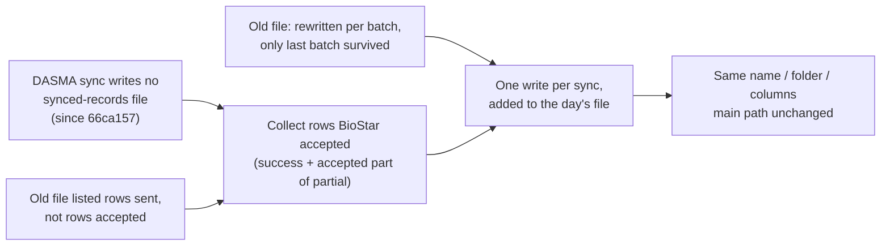

## DASMA sync: bring back the synced-records file, complete for the whole day

**TL;DR.** Think of a delivery log book that someone threw away while tidying up the loading dock:
the parcels still go out, but nobody can see who received one.
- Since 2026-09-23 (`66ca157`) the DASMA sync no longer writes
  `logs/synced-records/json/synced_<type>_<date>.json` (and its CSV copy).
- Even before that, the file lost data: every batch rewrote it, so only the day's last batch
  survived, and it listed users *sent*, not users BioStar *accepted*.
- This plan puts the file back under the same name, folder and columns. Each sync adds the
  users BioStar accepted to that day's file (Romeo's choice, 2026-09-24: "Same name, whole day").

### Flowchart (high-level)



### Task metadata

- Classification: `BUG` (regression) · Standard · database-sync (Dasma path) · Medium.
- Docs loaded: `planning.md, plan-template.md`.
- Root cause: `66ca157` (`fix(dasma): … drop per-row logs`) deleted the only Dasma call
  `await this.commonService.logSyncedRecords(formattedRecords, jobName, true)`
  (`git log -S logSyncedRecords -- …dasma-path.service.ts` names only that commit). Evidence for:
  the newest file in `apps/backend/logs/synced-records/json/` is `synced_manual_2026_09_23.json`
  at 14:05, and jobs 30–39 (which sent up to 19,601 rows) wrote none. Would be disproved by:
  any `synced_manual_*` file dated after the local deploy of `66ca157`; none exists.
- Claims reversed while investigating:
  - "Nothing reads these files" (`docs/plans/dasma-biostar-import-pacing.md:1768`). No code
    reads them, but people do (the 2026-09-24 request), so the removal was wrong.
  - "The file listed every updated user". It did not: `logSyncedRecords` writes a per-day name
    with `fs.writeFileSync`, and the Dasma path called it once per batch, so each batch
    replaced the last.
- Gate-access invariants: none touched. The change only writes an audit file after
  `persistRowHashes`; `studentMutationLock`, deprovision rollback, roles and `reports` are
  not on this path. A failed write is logged, not thrown, so it cannot abort a sync after
  BioStar accepted the rows.
- Only the Dasma path changes behaviour. `DatabaseSyncMainPathService`
  (`database-sync-main-path.service.ts:555`) keeps calling `logSyncedRecords(formattedRecords,
  jobName)` without the flag, and that branch still replaces the file (a test pins this).
- Detected running model: Claude Opus 5.5. Recommended: `opus`, high, every phase (no switch
  stop); fallback `sonnet`, high.
- Branch: `fix/no-ticket-dasma-synced-records`, from `origin/main` (`c26a926`).
- Release path: one branch → one PR into `main`, merge commit. Romeo may again direct a local
  merge and push.
- Persona rounds: `project-manager` confirms this plan as the spec; no entity or migration, so
  no `database-architect`. Then `test-engineer` (RED), `nestjs-backend-dev` (GREEN),
  `code-reviewer` + `security-auditor` (review).
- Graphify: skipped by Romeo's standing instruction (setup incomplete, 2026-09-23). Discovery
  used `git grep` and `git log -S`.
- Execution preflight: `git fetch origin`, then `scripts/new-task-worktree.sh fix dasma-synced-records`,
  then link `apps/backend/logs` to the primary checkout's `apps/backend/logs` (the e2e suite
  writes there).

Paths: `C` = `apps/backend/src/database-sync/services/shared/database-sync-common.service.ts`,
`CS` = its `.spec.ts`, `D` = `apps/backend/src/database-sync/services/database-sync-dasma-path.service.ts`,
`PS` = its `.spec.ts`, `E2E` = `apps/backend/test/dasma-sync-biostar.e2e-spec.ts`.

### Phase 1 — RED (`opus`, high)

**1a. `CS`.** Old:

```ts
import { Test, TestingModule } from '@nestjs/testing';
import { ConfigService } from '@nestjs/config';
```

New:

```ts
import { Test, TestingModule } from '@nestjs/testing';
import { ConfigService } from '@nestjs/config';
import * as fs from 'fs';
import * as path from 'path';
```

Append at the end of `CS`:

```ts
describe('DatabaseSyncCommonService — synced-records file', () => {
  let service: DatabaseSyncCommonService;
  const jsonDir = path.join(process.cwd(), 'logs', 'synced-records', 'json');
  const csvDir = path.join(process.cwd(), 'logs', 'synced-records', 'csv');
  const day = new Date().toISOString().split('T')[0].replace(/-/g, '_');
  const prefix = `synced_zztest1_${day}`;
  const jsonFile = path.join(jsonDir, `${prefix}.json`);
  const csvFile = path.join(csvDir, `${prefix}.csv`);
  const row = (user_id: string) => ({
    user_id,
    name: 'Santos Juan',
    department: 'DLSU',
    user_title: 'Student',
    user_group: 'All Users',
    remarks: '',
    csn: '',
    start_datetime: '2026-09-23 00:00:00.000',
    expiry_datetime: '2036-09-24 00:00:00.000',
    original_campus_entry: 'Y',
  });
  const ids = () =>
    (JSON.parse(fs.readFileSync(jsonFile, 'utf8')) as { user_id: string }[]).map(
      (r) => r.user_id,
    );
  const cleanUp = () => {
    for (const dir of [jsonDir, csvDir]) {
      if (!fs.existsSync(dir)) continue;
      for (const f of fs.readdirSync(dir)) {
        if (f.startsWith(prefix)) fs.unlinkSync(path.join(dir, f));
      }
    }
  };

  beforeEach(async () => {
    const module: TestingModule = await Test.createTestingModule({
      providers: [
        DatabaseSyncCommonService,
        { provide: ConfigService, useValue: { get: jest.fn() } },
      ],
    }).compile();
    service = module.get<DatabaseSyncCommonService>(DatabaseSyncCommonService);
    cleanUp();
  });

  afterEach(cleanUp);

  it('error: moves an unreadable day file aside instead of overwriting it', async () => {
    fs.mkdirSync(jsonDir, { recursive: true });
    fs.writeFileSync(jsonFile, '[{"user_id":"91200011"');

    await service.logSyncedRecords([row('91200012')], 'zztest-1', true);

    expect(ids()).toEqual(['91200012']);
    expect(
      fs.readdirSync(jsonDir).some((f) => f.startsWith(`${prefix}.unreadable-`)),
    ).toBe(true);
  });

  it('edge: writes the CSV header once when a later sync adds to the day', async () => {
    await service.logSyncedRecords([row('91200011')], 'zztest-1', true);
    await service.logSyncedRecords([row('91200012')], 'zztest-1', true);

    const lines = fs.readFileSync(csvFile, 'utf8').trim().split('\n');
    expect(lines).toHaveLength(3);
    expect(lines[0].startsWith('user_id,')).toBe(true);
  });

  // Measured 2026-09-24: each write replaced the day's file, so only the
  // last batch of the day survived.
  it('regression: a later Dasma sync the same day adds to the file instead of replacing it', async () => {
    await service.logSyncedRecords([row('91200011')], 'zztest-1', true);
    await service.logSyncedRecords([row('91200012')], 'zztest-1', true);

    expect(ids()).toEqual(['91200011', '91200012']);
  });

  it('happy: the main path still replaces its file on each write', async () => {
    await service.logSyncedRecords([row('91200011')], 'zztest-1');
    await service.logSyncedRecords([row('91200012')], 'zztest-1');

    expect(ids()).toEqual(['91200012']);
  });
});
```

**1b. `PS`.** Old (the last test of `describe('Fewer calls per sync'`):

```ts
      expect(biostarApi.getApiToken).toHaveBeenCalledTimes(1);
    });
  });
```

New:

```ts
      expect(biostarApi.getApiToken).toHaveBeenCalledTimes(1);
    });

    it('error: a synced-records file that cannot be written does not fail the sync', async () => {
      (sql.connect as jest.Mock).mockResolvedValue(poolAnswering(null));
      (commonService.logSyncedRecords as jest.Mock).mockRejectedValueOnce(
        new Error('ENOSPC: no space left on device'),
      );
      sourceRows = threeRows();
      setClock('2026-08-26T08:00:00+08:00');

      await expect(service.executeDatabaseSync('run-1')).resolves.toMatchObject({
        success: true,
      });
      expect(importCalls()).toBe(1);
    });

    it('edge: a sync that sends nothing writes no synced-records file', async () => {
      (sql.connect as jest.Mock).mockResolvedValue(poolAnswering(null));
      sourceRows = threeRows();
      setClock('2026-08-26T08:00:00+08:00');
      await service.executeDatabaseSync('run-1');
      (commonService.logSyncedRecords as jest.Mock).mockClear();

      setClock('2026-08-27T08:00:00+08:00');
      await service.executeDatabaseSync('run-2');

      expect(commonService.logSyncedRecords).not.toHaveBeenCalled();
    });

    // Measured 2026-09-24: the Dasma path stopped writing this file on
    // 2026-09-23 (66ca157); before that each batch overwrote the last.
    it('regression: records every user BioStar accepted in one synced-records write per sync', async () => {
      (sql.connect as jest.Mock).mockResolvedValue(poolAnswering(null));
      CONFIG.BIOSTAR_IMPORT_MAX_ROWS = '2';
      sourceRows = [
        ...threeRows(),
        sourceRow({ ID: '12100004' }),
        sourceRow({ ID: '12100005' }),
      ];
      setClock('2026-08-26T08:00:00+08:00');

      await service.executeDatabaseSync('run-1');

      const calls = (commonService.logSyncedRecords as jest.Mock).mock.calls;
      expect(calls).toHaveLength(1);
      expect(
        (calls[0][0] as Record<string, string>[]).map((r) => r.user_id),
      ).toEqual(['12100001', '12100002', '12100003', '12100004', '12100005']);
      expect(calls[0][1]).toBe('run-1');
      expect(calls[0][2]).toBe(true);
    });
  });
```

**1c. `E2E`.** Directly before
`  // BioStar's error file cannot always be trusted to name our rows`, insert (write it with a
script that emits a literal backslash for ``, per the memory note on unicode escapes):

```ts
  it('regression: the synced-records file lists only the rows BioStar accepted', async () => {
    const logged = jest
      .spyOn(DatabaseSyncCommonService.prototype, 'logSyncedRecords')
      .mockResolvedValue(undefined);
    try {
      sourceRows = [
        sourceRow(),
        sourceRow({ ID: '12100002', FirstName: 'Maria' }),
      ];
      biostar.scenario.importCode = '1';
      biostar.scenario.importFailedRows = ['2'];
      biostar.scenario.errorCsv =
        'user_id,name,Error_Description\r\n12100001,Dela Cruz Juan,Rejected.\r\n';

      await service.executeDatabaseSync('e2e-1');

      expect(logged).toHaveBeenCalledTimes(1);
      expect(
        (logged.mock.calls[0][0] as Record<string, string>[]).map(
          (r) => r.user_id,
        ),
      ).toEqual(['12100002']);
    } finally {
      logged.mockRestore();
    }
  }, 120000);

```

**1d. RED run:** `npm run tdd:red`, then
`cd apps/backend && TZ=Asia/Manila npx jest --config ./test/jest-e2e.json -t "only the rows BioStar accepted"`.
Must fail: `CS` error, edge, regression; `PS` error, regression; `E2E` new test.
May pass: `CS` happy (pins current main-path behaviour) and `PS` edge (nothing is written today).
Any other failure: stop and report. Commit:
`test(dasma): RED for restoring the day's synced-records file`.

### Phase 2 — GREEN (`opus`, high)

**2a. `C`.** Old:

```ts
    const jsonFilePath = path.join(
      this.syncedJsonDir,
      `synced_${syncType}_${dateString}.json`,
    );
    fs.writeFileSync(jsonFilePath, JSON.stringify(rowsForLog, null, 2));

    const csvFilePath = path.join(
      this.syncedCsvDir,
      `synced_${syncType}_${dateString}.csv`,
    );
    const csvWriter = createObjectCsvWriter({
      path: csvFilePath,
      header: csvHeaders,
    });

    await csvWriter.writeRecords(rowsForLog);
```

New:

```ts
    fs.mkdirSync(this.syncedJsonDir, { recursive: true });
    fs.mkdirSync(this.syncedCsvDir, { recursive: true });
    const jsonFilePath = path.join(
      this.syncedJsonDir,
      `synced_${syncType}_${dateString}.json`,
    );
    const csvFilePath = path.join(
      this.syncedCsvDir,
      `synced_${syncType}_${dateString}.csv`,
    );

    // The Dasma file is the day's record of who BioStar updated, so each sync
    // adds to it. Replacing it on every write kept only the last batch.
    const addToDay = auditAsDasmaBulkUpload;
    const earlier = addToDay ? this.readSyncedDayFile(jsonFilePath) : [];
    // Written aside, then renamed: an interrupted write never leaves a torn file.
    const jsonTempPath = `${jsonFilePath}.tmp`;
    fs.writeFileSync(
      jsonTempPath,
      JSON.stringify([...earlier, ...rowsForLog], null, 2),
    );
    fs.renameSync(jsonTempPath, jsonFilePath);

    const csvWriter = createObjectCsvWriter({
      path: csvFilePath,
      header: csvHeaders,
      append: addToDay && fs.existsSync(csvFilePath),
    });

    await csvWriter.writeRecords(rowsForLog);
```

Old:

```ts
  getLogDir(): string {
    return this.logDir;
  }
```

New:

```ts
  /**
   * Rows already in today's Dasma synced-records file. A file that is not a
   * readable list is moved aside, never overwritten, so no day's record is
   * lost to one bad write.
   */
  private readSyncedDayFile(jsonFilePath: string): Record<string, unknown>[] {
    if (!fs.existsSync(jsonFilePath)) return [];
    try {
      const parsed: unknown = JSON.parse(fs.readFileSync(jsonFilePath, 'utf8'));
      if (Array.isArray(parsed)) return parsed as Record<string, unknown>[];
    } catch {
      // Not JSON; handled below exactly like a non-list.
    }
    const aside = jsonFilePath.replace(
      /\.json$/,
      `.unreadable-${Date.now()}.json`,
    );
    fs.renameSync(jsonFilePath, aside);
    this.logger.warn(
      `Synced-records file was not a readable list; kept it as ${aside} and started a new one`,
    );
    return [];
  }

  getLogDir(): string {
    return this.logDir;
  }
```

`csv-writer` 1.6.0 supports `append` (`node_modules/csv-writer/src/lib/csv-writer-factory.ts:12`;
`csv-writer.ts:24` skips the header when `append` is true).

**2b. `D`.** Old:

```ts
      const pendingHashes = new Map<string, string>();
      let importNumber = 0;
```

New:

```ts
      const pendingHashes = new Map<string, string>();
      let importNumber = 0;
      /** Rows BioStar accepted this run: the day's synced-records file. */
      const deliveredRows: Record<string, string>[] = [];
```

Old:

```ts
              await this.persistRowHashes(
                formattedRecords,
                rowHashes,
                timingsMs,
              );
            } else if (outcome === 'timeout') {
```

New:

```ts
              await this.persistRowHashes(
                formattedRecords,
                rowHashes,
                timingsMs,
              );
              deliveredRows.push(...formattedRecords);
            } else if (outcome === 'timeout') {
```

Old:

```ts
                  const rejectedSet = new Set(rejected);
                  await this.persistRowHashes(
                    formattedRecords.filter((r) => !rejectedSet.has(r.user_id)),
                    rowHashes,
                    timingsMs,
                  );
```

New:

```ts
                  const rejectedSet = new Set(rejected);
                  const accepted = formattedRecords.filter(
                    (r) => !rejectedSet.has(r.user_id),
                  );
                  await this.persistRowHashes(accepted, rowHashes, timingsMs);
                  deliveredRows.push(...accepted);
```

Old:

```ts
      // The last, partly filled import.
      while (importQueue.size > 0) {
        await uploadImport(takeImport(), pendingHashes);
      }
      await this.commonService.cleanupTempFiles(tempDir);
```

New:

```ts
      // The last, partly filled import.
      while (importQueue.size > 0) {
        await uploadImport(takeImport(), pendingHashes);
      }
      await this.commonService.cleanupTempFiles(tempDir);

      // The day's record of who BioStar updated (logs/synced-records), written
      // once per sync and only with rows BioStar confirmed. A failed write
      // costs that record, never the sync: BioStar already has the rows.
      if (deliveredRows.length > 0) {
        try {
          await this.commonService.logSyncedRecords(
            deliveredRows,
            jobName,
            true,
          );
        } catch (error) {
          this.logger.warn(
            `[Dasma] Could not write the synced-records file: ${
              (error as Error)?.message ?? String(error)
            }`,
          );
        }
      }
```

**2c.** `npx prettier --write` on `C`, `CS`, `D`, `PS`, `E2E`. Commit:
`fix(dasma): restore the synced-records file, one write per sync, added to the day`.

Done: every Phase 1 test passes.

### Phase 3 — Validation (`opus`, high)

```bash
cd apps/backend && npx tsc --noEmit && npx eslint src/database-sync test && TZ=Asia/Manila npx jest && TZ=Asia/Manila npx jest --config ./test/jest-e2e.json
```

Expected: unit 320 + 4 `CS` + 3 `PS` = **327**, e2e 48 + 1 = **49**, all passing. Then
`bun run build:backend && npm run tdd:gate`.

Live check (one Sync, nothing else): run a sync that sends at least one row on the sandbox; then
`logs/synced-records/json/synced_manual_<UTC date>.json` exists, is a JSON list, holds exactly
that sync's `emittedIds` minus `rowsRejectedByBiostar`, and the backend log shows
`Saved <n> synced records to:`.

### Phase 4 — Review and handoff (`opus`, high)

`code-reviewer` then `security-auditor` on `git diff origin/main...HEAD` (focus: no throw after
BioStar accepted rows; the PII surface is unchanged: same columns, same folder, same one-month
cleanup in `DatabaseSyncService.ensureLogDirectory`). `docs/ai/handoff.md` Completion Gate.
PR: `gh auth switch --hostname github.com --user OwlRepo && gh pr create`, body with TL;DR,
RED output, Phase 3 output, and `🤖 Generated with [Claude Code](https://claude.com/claude-code)`.

### Validation and acceptance

| Layer | Required | File | Cases |
|---|---|---|---|
| Unit — file writer | yes | `CS` | error: unreadable day file moved aside · edge: CSV header once · regression: day file grows · happy: main path still replaces |
| Unit — Dasma push | yes | `PS` | error: failed write keeps the sync successful · edge: nothing sent, nothing written · regression: one write with every accepted user |
| e2e | yes | `E2E` | regression: partial import lists only accepted rows |
| Migration / portal | not required | — | no schema change; no UI |

Five buckets: happy (main path), error (write failure; unreadable file), edge (empty run; CSV
header), rare/boundary (partial import), performance (one write per sync instead of one per
batch).

| Regression risk | Symbol | Proof |
|---|---|---|
| A write error aborts a sync BioStar already applied | `D` final-flush `try/catch` | `PS` error test |
| Main path's file changes shape or name | `C.logSyncedRecords` `addToDay` false | `CS` happy test |
| A torn or hand-edited day file is overwritten | `C.readSyncedDayFile` | `CS` error test |
| Rejected rows listed as updated | `D` partial branch `accepted` | `E2E` test |

### Compatibility, docs, and scans

- Same folder, file names and columns as before `66ca157`; the Dasma file now grows through the
  day instead of being replaced. The date in the name stays UTC, as before.
- No env, schema or API change. `docs/ai/*` unaffected.
- Optimization scan: one file write per sync replaces one per batch (up to about 200 rewrites
  on a full resend); temp-file-and-rename makes each write safe. Left as-is: the day file is
  re-read once per sync (a full 20k resend is about 6 MB), fine for a nightly job.
- Cache scan: not applicable. DB impact: none (no queries added).

### Rollback

`git revert -m 1 <merge>`. No data repair. Files already written remain and age out after a month.
